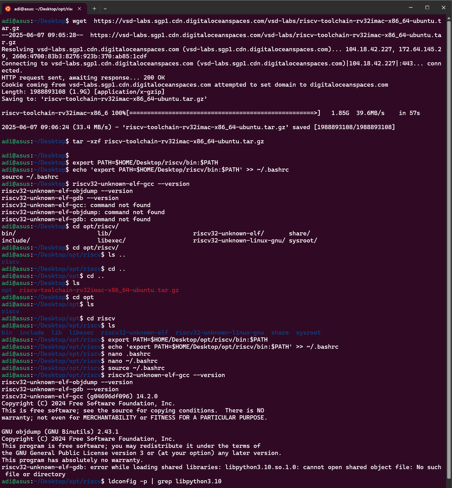

### Unpacking and Setting Up `riscv-toolchain-rv32imac-x86_64-ubuntu.tar.gz`

#### Step 1: Extract the Archive

In your terminal, navigate to the directory containing the file and run:

```bash
tar -xzf riscv-toolchain-rv32imac-x86_64-ubuntu.tar.gz
```

This will create a folder, typically named something like `riscv-toolchain` or similar.

---

#### Step 2: Add the Toolchain to PATH

Assuming the extracted folder is in your home directory and named `riscv-toolchain`, add the following line to your shell configuration file:

**For bash:**

```bash
echo 'export PATH=$HOME/riscv-toolchain/bin:$PATH' >> ~/.bashrc
source ~/.bashrc
```

**For zsh:**

```bash
echo 'export PATH=$HOME/riscv-toolchain/bin:$PATH' >> ~/.zshrc
source ~/.zshrc
```

Replace `riscv-toolchain` with the actual folder name if it differs.

---

#### Step 3: Verify Installation

Use the following commands to confirm that the toolchain is properly set up:

```bash
riscv32-unknown-elf-gcc --version
riscv32-unknown-elf-objdump --version
riscv32-unknown-elf-gdb --version
```

Each command should return version information if the setup is correct.


# Output


