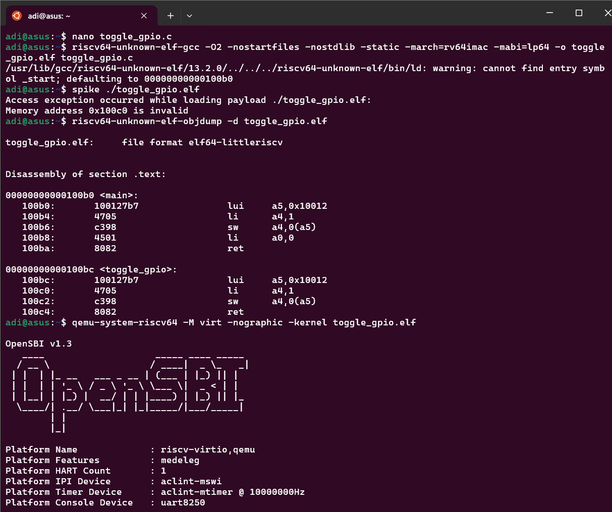
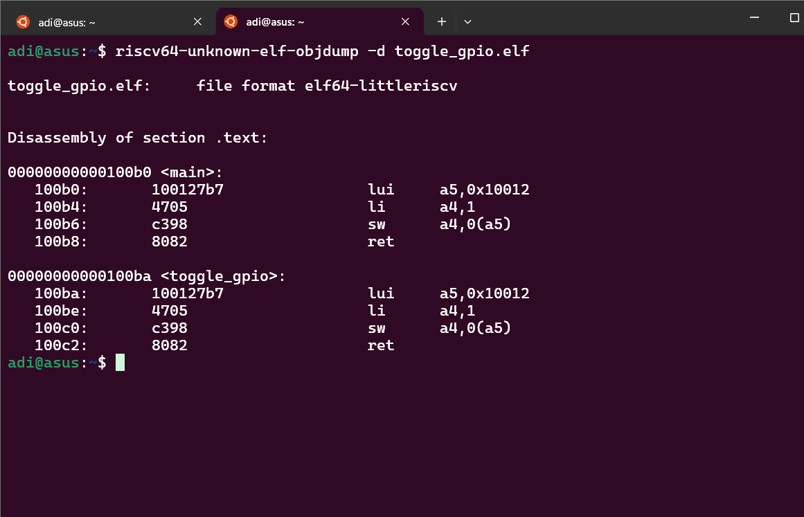

# 💾 Task 10: Memory-Mapped I/O Demo - GPIO Control using `volatile`

## 🎯 Objective

Demonstrate low-level **bare-metal programming** in RISC-V by toggling a **GPIO hardware register at memory address `0x10012000`** using C. Ensure the write operation is not optimized away by the compiler using the `volatile` keyword, and understand how memory alignment affects hardware access.

---

## 📚 Background

* In embedded systems, **memory-mapped I/O** is used to control hardware by writing directly to memory addresses.
* Compilers may **optimize away memory writes** that appear unused. `volatile` ensures that the compiler **does not remove or reorder** such accesses.
* The GPIO register at `0x10012000` is assumed to be a **32-bit hardware register**.

---

## 🧠 Key Concepts

| Concept                | Explanation                                                                                    |
| ---------------------- | ---------------------------------------------------------------------------------------------- |
| `volatile`             | Tells the compiler the value can change outside the program (e.g. hardware), so don’t optimize |
| Memory-Mapped I/O      | Hardware registers are mapped to memory addresses                                              |
| Alignment              | `uint32_t` requires 4-byte aligned addresses; `0x10012000` is properly aligned                 |
| Bare-metal Programming | Running code without an OS – no `main()` setup or standard libraries                           |

---

## ✅ Prerequisites

* ✅ Installed `riscv64-unknown-elf-gcc` toolchain
* ✅ `QEMU` installed to simulate RISC-V hardware
* ✅ Basic C knowledge: pointers, memory access
* ✅ Previous tasks covering inline assembly, optimization

---

## 🧪 Source Code (`toggle_gpio.c`)

```c
#include <stdint.h>

void toggle_gpio() {
    volatile uint32_t *gpio = (uint32_t *)0x10012000;
    *gpio = 0x1;  // Set GPIO HIGH
}

int main() {
    toggle_gpio();
    return 0;
}
```

### 🔎 Why `volatile`?

* Prevents this store: `*gpio = 0x1;` from being removed or optimized.
* Ensures **every access to `*gpio` actually happens**, crucial for hardware interaction.

---

## ⚙️ Compilation and Execution

### 🛠 Compile:

```bash
riscv64-unknown-elf-gcc -O2 -nostartfiles -nostdlib -static \
  -march=rv64imac -mabi=lp64 -o toggle_gpio.elf toggle_gpio.c
```

> ⚠️ Warning:
>
> ```
> ld: warning: cannot find entry symbol _start; defaulting to 00000000000100b0
> ```
>
> This is okay for minimal demos without startup code.

---

### 📦 Disassembly (Objdump):

```bash
riscv64-unknown-elf-objdump -d toggle_gpio.elf
```

Output:

```asm
100b0: 100127b7   lui     a5,0x10012      # Load GPIO address
100b4: 4705       li      a4,1            # Load value 1
100b6: c398       sw      a4,0(a5)        # Store 1 to GPIO (write)
```

Shows the memory-mapped I/O write is preserved ✅

---

### 🔧 Running the ELF

#### ❌ With Spike (Fails):

```bash
spike ./toggle_gpio.elf
```

> ❌ `Access exception occurred while loading payload`
> Spike doesn't simulate MMIO by default. Address `0x10012000` is invalid in Spike.

#### ✅ With QEMU (Works):

```bash
qemu-system-riscv64 -M virt -nographic -kernel toggle_gpio.elf
```

> ✅ Shows OpenSBI bootup, then quietly runs `toggle_gpio()`.

---

## 🧠 What We Learned

| Concept               | Description                                                                                |
| --------------------- | ------------------------------------------------------------------------------------------ |
| Bare-metal I/O        | You can access hardware directly by casting a pointer to the memory address                |
| Compiler optimization | `volatile` is critical for preventing the compiler from removing hardware I/O              |
| QEMU vs Spike         | Spike is useful for ISA simulation, but not for MMIO. Use QEMU for hardware access testing |
| Alignment             | Using `uint32_t` requires the address to be divisible by 4 – `0x10012000` is valid         |

---

## 📎 References

* [Embedded Systems: Memory-Mapped I/O – EE Times]
* [volatile in C – What it does and when to use it – Embedded.com]
* RISC-V GNU Toolchain: https://github.com/riscv-collab/riscv-gnu-toolchain

---

## 📁 Files Summary

| Filename               | Purpose                        |
| ---------------------- | ------------------------------ |
| `toggle_gpio.c`        | Main demo with `volatile`      |
| `toggle_gpio.elf`      | Compiled ELF binary            |
| `task10_no_volatile.c` | Optional: compare optimization |

---

## Output


