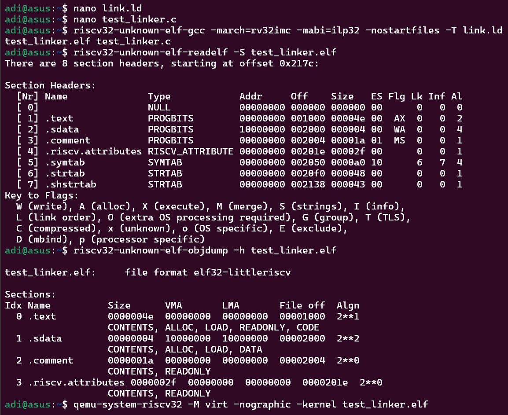

# Task 11: Linker Script 101 — Minimal Linker Script for RV32IMC

## Objective

Create a minimal linker script that places:

* `.text` section (code) at address **0x00000000** (typically Flash)
* `.data` section (initialized data) at address **0x10000000** (typically SRAM)

This task demonstrates basic memory layout control for bare-metal RISC-V embedded development.

---

## Background

### Why Separate `.text` and `.data` Sections?

* `.text`: Contains program instructions, usually stored in **Flash memory** starting at address 0x00000000.
* `.data`: Contains initialized global/static variables, stored in **RAM** at a different address (e.g., 0x10000000).
* The linker script controls where each section resides in memory.
* Proper placement is crucial for embedded systems because Flash and RAM have different addresses and properties.

### Why Different Addresses for Flash vs SRAM?

* Flash memory is **non-volatile** and usually mapped at low addresses.
* SRAM is **volatile**, faster, and mapped to different address ranges.
* Code runs from Flash or SRAM depending on the system, but data variables must be in RAM to be writable.

---

## Step 1: Create the Linker Script

Create a file `link.ld` with the following content:

```ld
/* Minimal Linker Script: link.ld */

SECTIONS
{
    /* Set location counter to 0x00000000 */
    . = 0x00000000;

    /* Place all .text* sections here */
    .text : {
        *(.text*)
    }

    /* Move location counter to 0x10000000 for data */
    . = 0x10000000;

    /* Place all .data* sections here */
    .data : {
        *(.data*)
    }
}
```

---

## Step 2: Write a Test Program `test_linker.c`

```c
#include <stdint.h>

// Global variable initialized to 42 goes to .data section
int global_data = 42;

// Dummy function to occupy .text section
void blink_led() {
    for (volatile int i = 0; i < 100000; ++i) {
        // Delay loop
    }
}

int main() {
    blink_led();
    return global_data;
}
```

---

## Step 3: Compile the Program with the Linker Script

Use the RISC-V GCC toolchain to compile and link:

```bash
riscv32-unknown-elf-gcc -march=rv32imc -mabi=ilp32 -nostartfiles -T link.ld -o test_linker.elf test_linker.c
```

* `-march=rv32imc`: Target RV32IMC architecture.
* `-mabi=ilp32`: 32-bit integer ABI.
* `-nostartfiles`: No standard startup files.
* `-T link.ld`: Use our custom linker script.

---

## Step 4: Verify Section Addresses

Check section addresses using `readelf` or `objdump`:

```bash
riscv32-unknown-elf-readelf -S test_linker.elf
```

Expected output snippet:

```
Section Headers:
  [Nr] Name      Type            Addr     Off    Size   ES Flg Lk Inf Al
  ...
  [ 1] .text     PROGBITS        00000000 000100 0000?? 00  AX  0   0  4
  [ 2] .data     PROGBITS        10000000 000??? 0000?? 00  WA  0   0  4
```

or

```bash
riscv32-unknown-elf-objdump -h test_linker.elf
```

Look for `.text` at `0x00000000` and `.data` at `0x10000000`.

---

## Optional Step 5: Run on QEMU or Spike Simulator

```bash
qemu-system-riscv32 -M virt -nographic -kernel test_linker.elf
```

or

```bash
spike test_linker.elf
```

No visible output expected; just verify no crashes.

---

## Explanation

### How the Linker Script Works

* The `SECTIONS` command controls memory layout.
* `. = 0x00000000;` sets the location counter (current address) to zero for `.text`.
* `.text : { *(.text*) }` places all `.text` sections from input files at this address.
* Then `. = 0x10000000;` moves the location counter to SRAM base address.
* `.data : { *(.data*) }` places all `.data` sections there.
* This way, code and data go to different memory regions as expected in embedded systems.

### Why is Alignment Important?

* The `uint32_t` accesses require 4-byte alignment.
* The linker script naturally aligns sections at 4-byte boundaries.
* Misaligned accesses can cause exceptions on RISC-V.

### What if No Linker Script is Provided?

* Default linker scripts place all sections contiguously in memory.
* For embedded systems, memory layout must match hardware specs.
* Custom linker scripts are essential.

---

## Summary

| Step          | What You Did                                         |
| ------------- | ---------------------------------------------------- |
| Write linker  | Defined `.text` at 0x00000000, `.data` at 0x10000000 |
| Write program | Created simple C program with `.text` and `.data`    |
| Compile       | Used RISC-V GCC with custom linker script            |
| Verify        | Checked `.text` and `.data` section addresses        |
| Explain       | Understood Flash vs SRAM address differences         |

---

## References

* RISC-V GCC Linker Scripts: [https://sourceware.org/binutils/docs/ld/Scripts.html](https://sourceware.org/binutils/docs/ld/Scripts.html)
* Embedded Systems Memory Layout Concepts
* RISC-V Architecture Specifications

---

## Output
