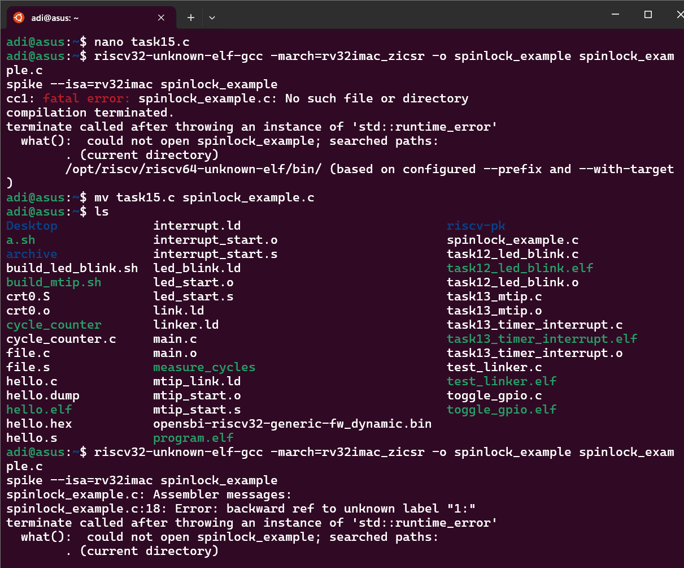
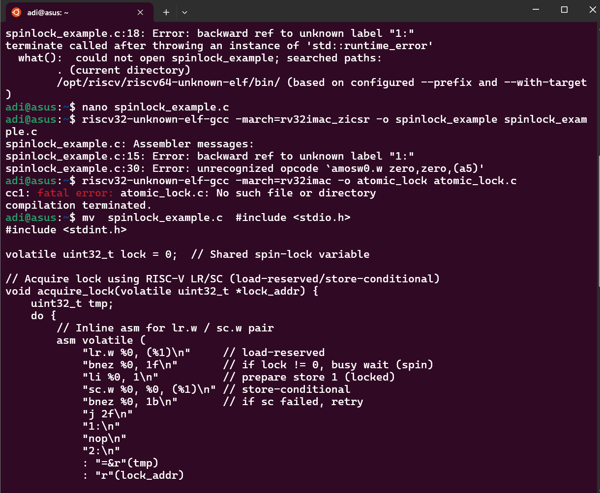
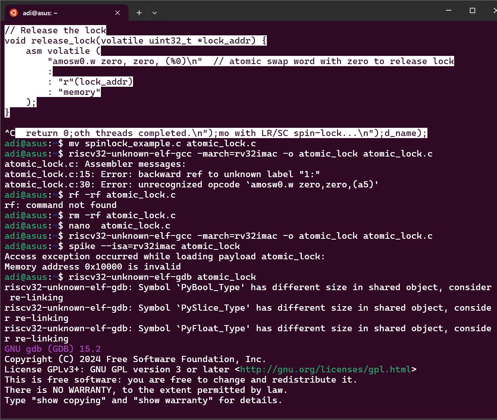
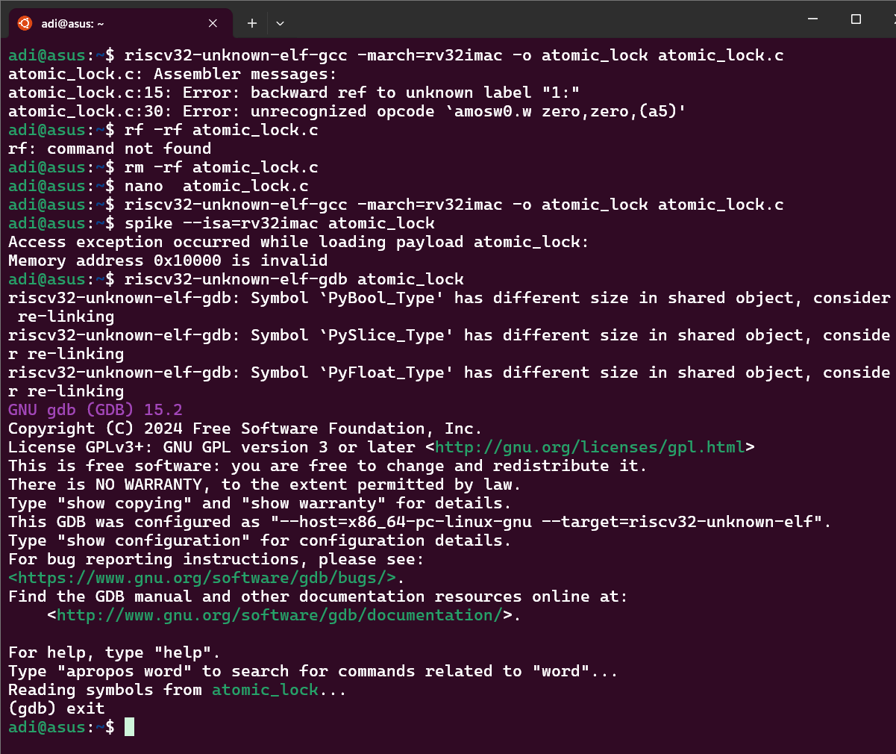
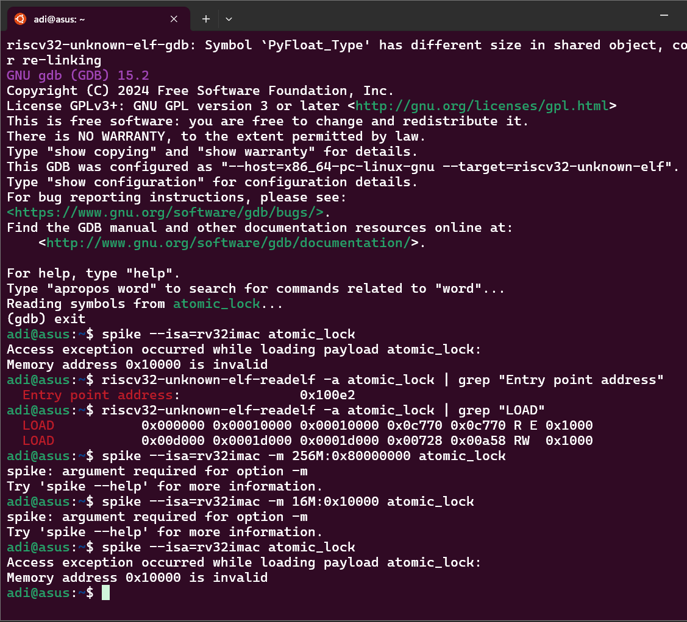

# task 15
# Atomic Test Program: Spin-Lock with LR/SC on RV32

## Overview

This project demonstrates a simple two-thread mutex (spin-lock) implemented using RISC-V atomic instructions `LR.W` (Load-Reserved) and `SC.W` (Store-Conditional) on a RV32IMAC processor.

The program simulates pseudo-threads in `main()` that try to acquire and release a spin-lock, showing how atomic operations help implement mutual exclusion without interrupts.

---

## Features

* Spin-lock implemented with inline assembly using `lr.w` and `sc.w`.
* Demonstrates atomicity for shared resource protection.
* Runs on Spike RISC-V ISA simulator with RV32IMAC.
* Requires a compatible linker script placing the program in valid memory.

---

## Prerequisites

* RISC-V GCC toolchain with support for RV32IMAC (e.g., `riscv32-unknown-elf-gcc`).
* Spike simulator ([https://github.com/riscv/riscv-isa-sim](https://github.com/riscv/riscv-isa-sim)).
* Basic knowledge of RISC-V assembly and C programming.
* Linux or WSL environment (tested on Ubuntu).

---

## Files

| File            | Description                                                   |
| --------------- | ------------------------------------------------------------- |
| `atomic_lock.c` | C source implementing spin-lock using LR/SC instructions.     |
| `link.ld`       | Linker script placing program at `0x80000000` (Spike default) |
| `build.sh`      | Bash script to build the program and run Spike simulator      |

---

## Building the Program

1. **Write your C code:** Make sure the file `atomic_lock.c` contains the atomic spin-lock example.

2. **Linker script:** Use `link.ld` to place `.text` and other segments at an address Spike recognizes (`0x80000000`).

3. **Compile and link:**

```bash
riscv32-unknown-elf-gcc -march=rv32imac -T link.ld -o atomic_lock atomic_lock.c
```

---

## Running the Program on Spike

Use Spike with memory mapped starting at `0x80000000` (matching linker script):

```bash
spike --isa=rv32imac -m 16M:0x80000000 atomic_lock
```

* `-m 16M:0x80000000` tells Spike to allocate 16MB of memory starting at `0x80000000`.
* The ELF loads at `0x80000000` as per the linker script.

---

## Example `link.ld` Linker Script

```ld
ENTRY(_start)

MEMORY
{
  RAM (rwx) : ORIGIN = 0x80000000, LENGTH = 16M
}

SECTIONS
{
  .text : {
    *(.text*)
  } > RAM

  .rodata : {
    *(.rodata*)
  } > RAM

  .data : {
    *(.data*)
  } > RAM

  .bss : {
    *(.bss*)
    *(COMMON)
  } > RAM
}
```

---

## Troubleshooting

* **Access exception: invalid memory address**

  This happens if Spike tries to load the ELF at an unmapped address.

  * Check the ELF load address with:

    ```bash
    riscv32-unknown-elf-readelf -l atomic_lock | Select-String LOAD
    ```

  * Run Spike with `-m <size>:<address>` where `<address>` is the ELF load address.

* **Assembler errors like unknown instructions**

  * Make sure to use the correct ISA flags (`-march=rv32imac`).
  * Confirm your RISC-V GCC toolchain supports atomic instructions (`lr.w`, `sc.w`).

---

## How the Spin-Lock Works

* The spin-lock uses two pseudo-threads in the `main()` function that try to acquire the lock variable.
* The lock variable is checked and updated atomically using `lr.w` and `sc.w` instructions in inline assembly.
* If the store-conditional (`sc.w`) fails (another thread changed the variable), the thread spins and retries.
* Once the lock is acquired, the critical section runs, and then the lock is released.
* This simulates mutual exclusion without disabling interrupts.

---

## References

* RISC-V Privileged Spec: [https://riscv.org/specifications/privileged-isa/](https://riscv.org/specifications/privileged-isa/)
* RISC-V Atomic Operations (A extension): [https://riscv.org/specifications/isa-spec-pdf/](https://riscv.org/specifications/isa-spec-pdf/)
* Spike Simulator GitHub: [https://github.com/riscv/riscv-isa-sim](https://github.com/riscv/riscv-isa-sim)

---

## Output




