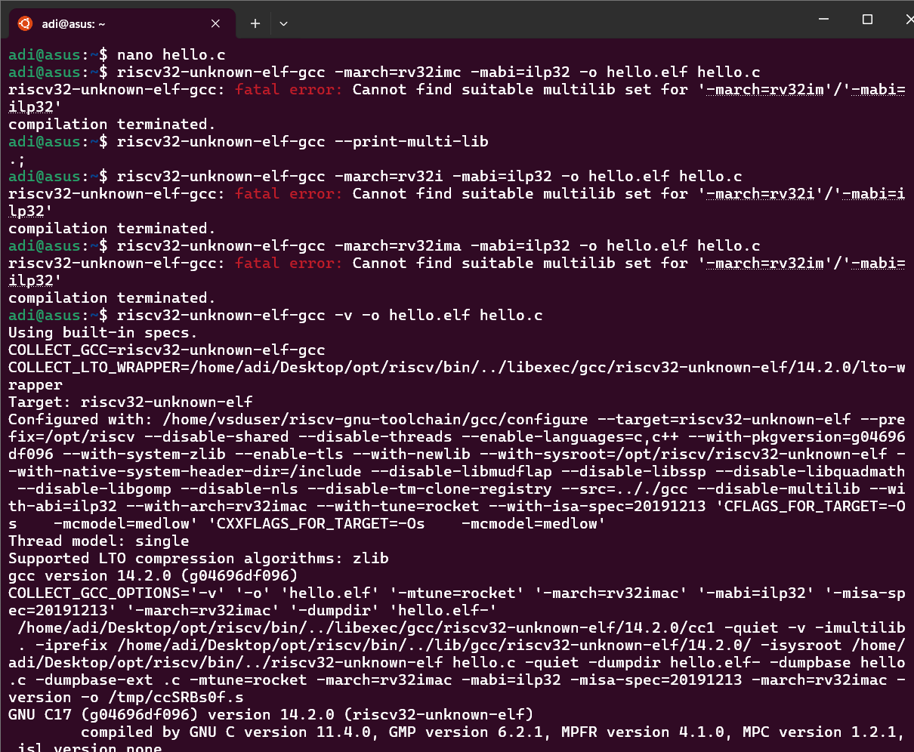
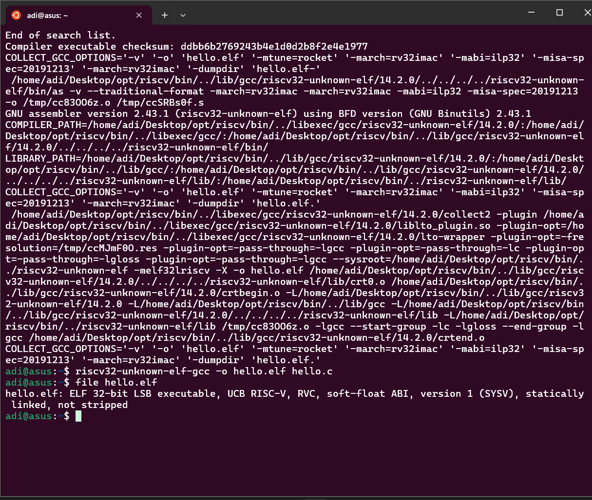

# Task 2: Compile “Hello, RISC-V”

## Objective

Compile a minimal C "Hello, RISC-V" program cross-compiled for the RV32IMC architecture using the RISC-V GCC toolchain, and generate a valid ELF executable.

---

## Steps Performed

### 1. Write a minimal Hello World C program

Create `hello.c` with the following content:

```c
#include <stdio.h>

int main() {
    printf("Hello, RISC-V!\n");
    return 0;
}
```

---

### 2. Initial compilation attempt with flags

Tried to compile using the recommended flags for RV32IMC and ILP32 ABI:

```bash
riscv32-unknown-elf-gcc -march=rv32imc -mabi=ilp32 -o hello.elf hello.c
```

---

### 3. Issue faced

Received error:

```
fatal error: Cannot find suitable multilib set for '-march=rv32im'/'-mabi=ilp32'
compilation terminated.
```

* Similarly, attempts with `-march=rv32i`, `-march=rv32ima` failed with the same error.
* Running `riscv32-unknown-elf-gcc --print-multi-lib` returned only `. ;` meaning no multilib support.

---

### 4. Diagnosis

* The installed RISC-V GCC toolchain has **multilib disabled** (`--disable-multilib`).
* The toolchain is **pre-configured to use exactly**:

  * Architecture: `rv32imac`
  * ABI: `ilp32`
* This means custom `-march` or `-mabi` flags are **not supported** because there’s only one fixed target.

---

### 5. Correct compilation method

* **Do not specify** `-march` or `-mabi` explicitly.
* Compile using the default configuration only:

```bash
riscv32-unknown-elf-gcc -o hello.elf hello.c
```

* This uses the default architecture and ABI embedded in the toolchain (`rv32imac` + `ilp32`).

---

### 6. Verification

* Check the compiled ELF file:

```bash
file hello.elf
```

Expected output similar to:

```
hello.elf: ELF 32-bit LSB executable, ...
```

* This confirms the binary is for 32-bit RISC-V.

---

## Summary of Lessons Learned

| Problem                               | Cause                                        | Solution                                                                 |
| ------------------------------------- | -------------------------------------------- | ------------------------------------------------------------------------ |
| Fatal error: no suitable multilib set | Toolchain compiled with `--disable-multilib` | Compile without specifying `-march` or `-mabi` flags. Use defaults only. |

---

## Notes

* To compile for other architectures or ABIs (e.g., `rv32imc` only), you need a **multilib-enabled** RISC-V toolchain.
* For now, the fixed target `rv32imac` + `ilp32` is the only supported combination in this toolchain.

---

If you want, I can help with the next task, such as generating assembly (`.s`) from your source.

---

output

