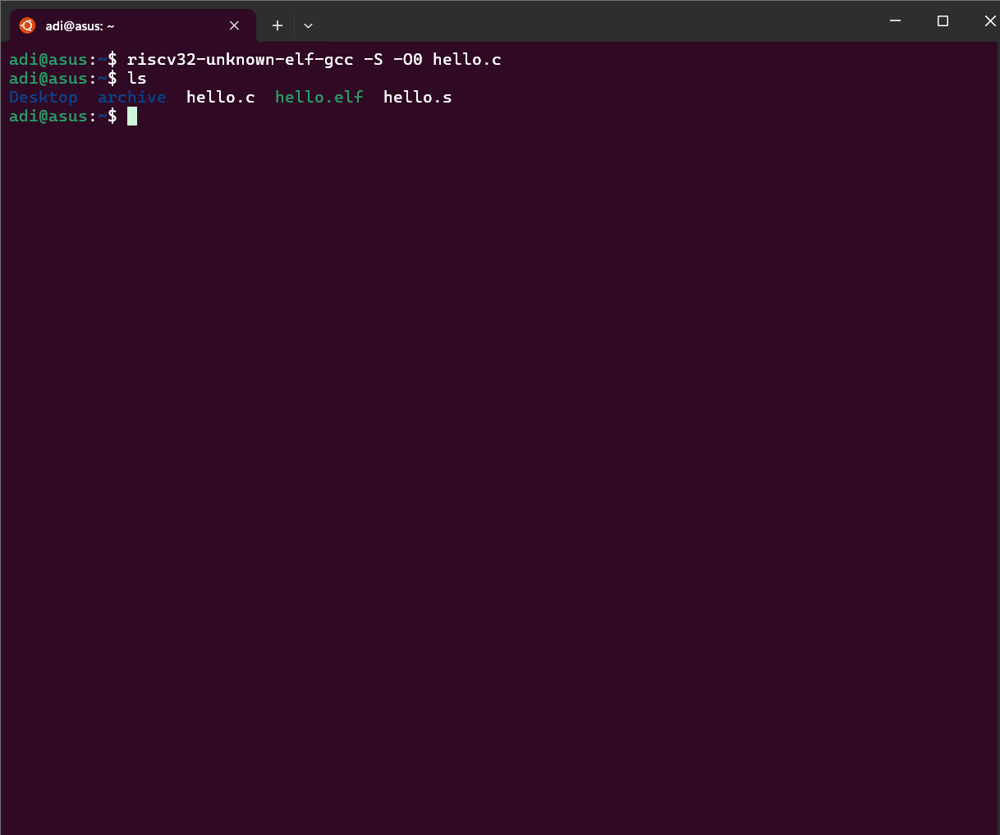
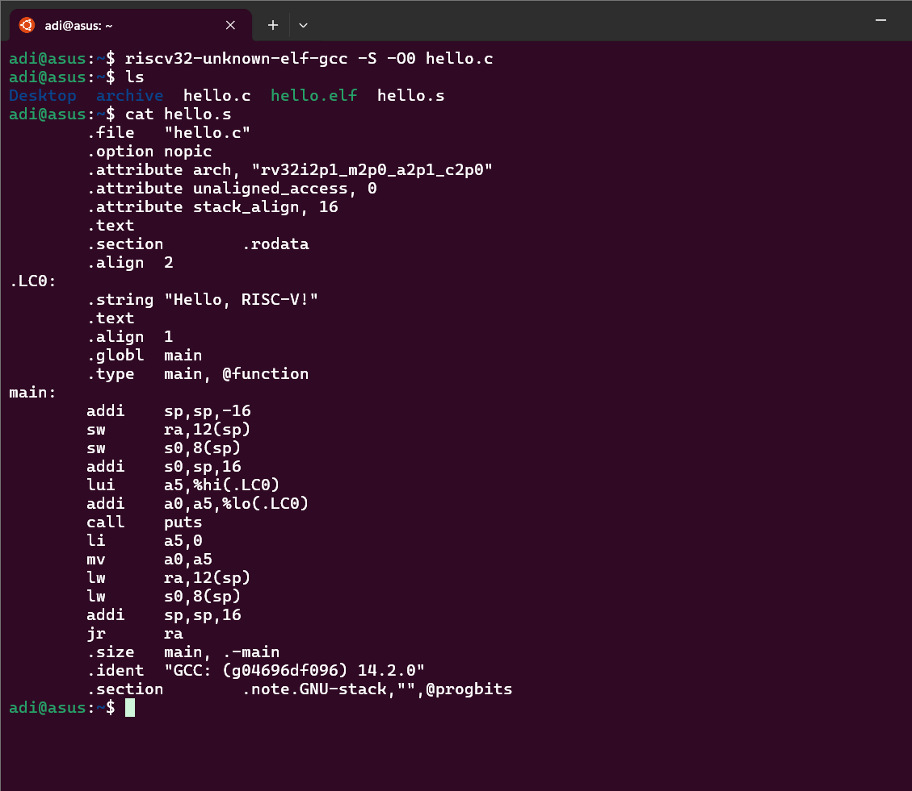

---

# Task 3: From C to Assembly

## Objective

Generate the assembly (`.s`) file from a simple C program (`hello.c`) and explain the function prologue and epilogue seen in the assembly output of the `main` function.

---

## Steps

1. **Create the C source file**
   Write your C program (`hello.c`):

   ```c
   #include <stdio.h>

   int main() {
       puts("Hello, RISC-V!");
       return 0;
   }
   ```

2. **Generate Assembly file**
   Use the RISC-V GCC compiler to generate the assembly output without optimization:

   ```bash
   riscv32-unknown-elf-gcc -S -O0 hello.c
   ```

   This produces `hello.s` containing the assembly code for your C program.

3. **View the Assembly code**

   ```bash
   cat hello.s
   ```

---

## Key Assembly Sections for `main`

### Prologue

```asm
addi    sp, sp, -16      # Allocate stack space (16 bytes)
sw      ra, 12(sp)       # Save return address (ra)
sw      s0, 8(sp)        # Save frame pointer (s0)
addi    s0, sp, 16       # Set new frame pointer (s0)
```

* Sets up a new stack frame for the function.
* Saves caller’s context (return address and old frame pointer).
* Prepares frame pointer for local variable access.

### Function Body

```asm
lui     a5, %hi(.LC0)   # Load upper part of string address
addi    a0, a5, %lo(.LC0)  # Load lower part; set up argument for puts
call    puts            # Call puts function to print string
li      a5, 0           # Prepare return value 0
mv      a0, a5          # Move return value to a0 register
```

* Loads the string literal’s address.
* Calls the `puts` function.
* Sets return value (0) for `main`.

### Epilogue

```asm
lw      ra, 12(sp)      # Restore return address
lw      s0, 8(sp)       # Restore frame pointer
addi    sp, sp, 16      # Deallocate stack space
jr      ra              # Return to caller
```

* Restores saved registers.
* Cleans up the stack frame.
* Returns control to the caller.

---

## Explanation

* The **prologue** prepares the stack and saves the return address and frame pointer so that the function can use local variables safely without corrupting the caller’s environment.
* The **epilogue** restores the saved registers and resets the stack before returning, ensuring the caller can resume execution correctly.
* Stack pointer adjustments (`addi sp, sp, -16` and `addi sp, sp, 16`) manage the local stack frame size.
* `ra` holds the return address, and `s0` is commonly used as the frame pointer.
* This calling convention and stack frame setup are typical in RISC-V assembly for C functions.

---

## Summary

* Command `riscv32-unknown-elf-gcc -S -O0 hello.c` generates readable assembly code.
* Understanding prologue and epilogue is crucial for low-level debugging and compiler behavior analysis.
* This knowledge is foundational for embedded programming and systems development on RISC-V.

---


output

