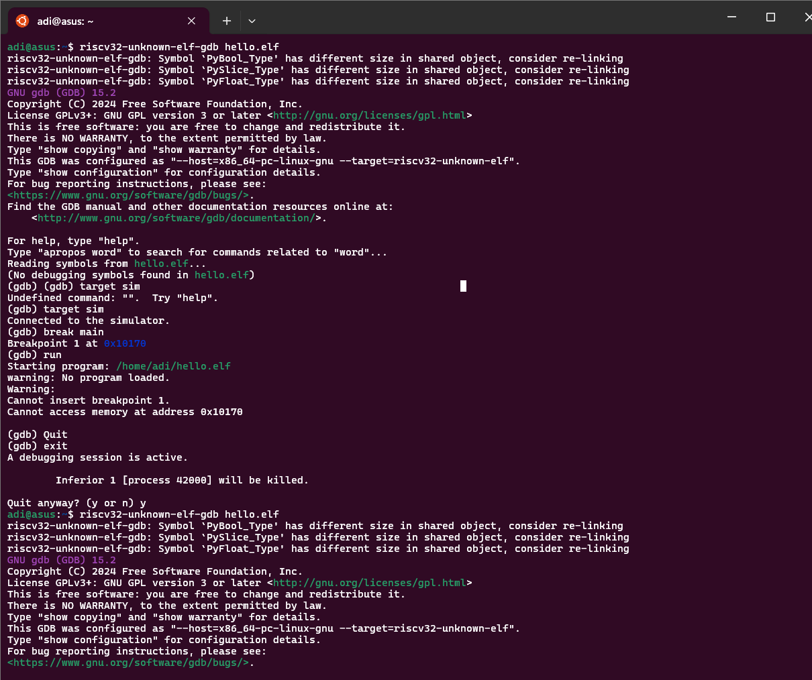
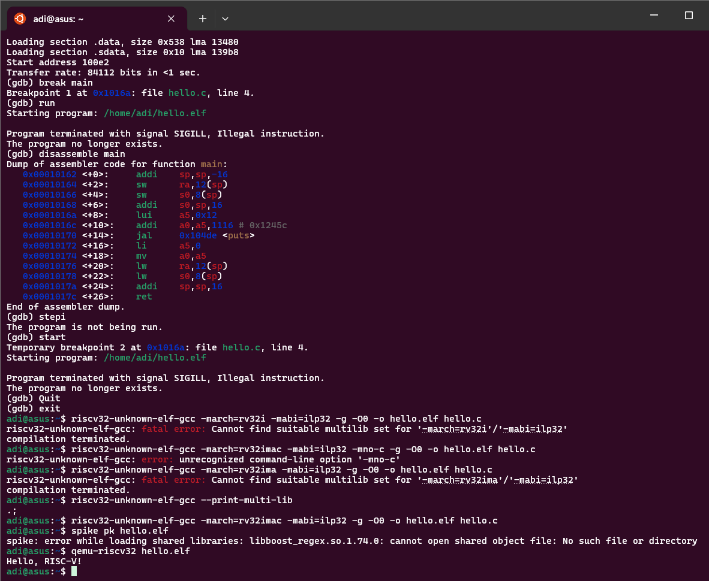
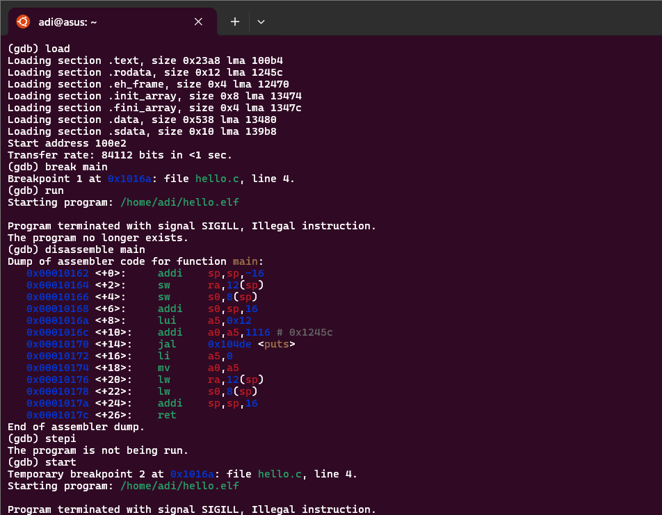

# Task 6: Running a RISC-V "Hello World" Program on QEMU

This document explains the process of compiling and running a simple RISC-V "Hello World" program using the QEMU emulator. It covers compilation options, execution steps, and common issues faced during the task.

---

## Objective

* Compile a simple C program (`hello.c`) targeting the RISC-V 32-bit architecture.
* Run the compiled program using the QEMU RISC-V 32-bit emulator.
* Verify that the program outputs the expected message:
  `Hello, RISC-V!`

---

## Environment Setup

* **Toolchain:** `riscv32-unknown-elf-gcc` cross-compiler
* **Emulator:** `qemu-riscv32`
* **Host OS:** Linux (Ubuntu or similar)
* **Program:** Simple "Hello World" in C (`hello.c`)

---

## Steps

1. **Write the Program (`hello.c`)**

    ```c
    #include <stdio.h>

    int main() {
        printf("Hello, RISC-V!\n");
        return 0;
    }
    ```

2. **Compile the Program**

    ```bash
    riscv32-unknown-elf-gcc -march=rv32imac -mabi=ilp32 -g -O0 -o hello.elf hello.c
    ```

    * If you get multilib errors, use only the default configuration:
      ```bash
      riscv32-unknown-elf-gcc -o hello.elf hello.c
      ```

3. **Run on QEMU**

    ```bash
    qemu-riscv32 hello.elf
    ```

    Expected output:
    ```
    Hello, RISC-V!
    ```

---

## Troubleshooting


- If you get errors about missing libraries with Spike, use QEMU instead.
- If you get multilib errors, do not specify `-march`/`-mabi` flags.
- If you get **SIGILL (illegal instruction) in GDB simulator**, you can use GDB to find the exact instruction causing the crash:

  #### Step-by-step commands to run inside GDB:
  ```gdb
  (gdb) target sim
  (gdb) load
  (gdb) break main
  (gdb) run
  # If program crashes with SIGILL, do this next:
  (gdb) start       # Restart at main function
  (gdb) stepi       # Step one instruction at a time
  (gdb) stepi
  (gdb) stepi
  ... keep running `stepi` ...
  # After each stepi, check if program crashed
  ```

  To monitor the instruction and registers:
  ```gdb
  (gdb) x/1i $pc     # Show instruction at current PC
  (gdb) info registers  # See register values
  ```

  **Why do this?**
  - `stepi` steps one instruction at a time — you’ll find the exact instruction causing SIGILL.
  - `x/1i $pc` shows the instruction about to run.
  - When it crashes, the last instruction you stepped was the problem.

---

## Output


