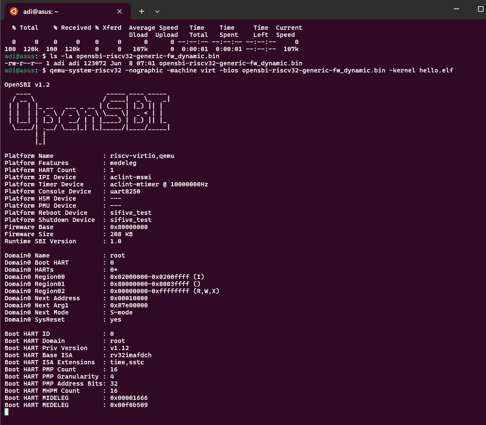

# Task 7: Running Under an Emulator

## Objective

Boot a bare-metal RISC-V ELF binary and print to the UART console using either Spike or QEMU, simulating real hardware output.

---

## Prerequisites

- **RISC-V GCC toolchain** (to build your ELF, e.g., `hello.elf`)
- **Spike** (RISC-V ISA simulator) and/or **QEMU** (system emulator)
- **Proxy Kernel (`pk`)** for Spike (if using Spike)
- Your compiled ELF binary (e.g., `hello.elf`)

---

## Method

You can use either Spike or QEMU to run your ELF and see UART output in your terminal.

### 1. Using Spike (with Proxy Kernel)

Spike requires the proxy kernel (`pk`) to boot and provide basic I/O:

```bash
spike --isa=rv32imc pk hello.elf
```

- `--isa=rv32imc`: Sets the instruction set architecture (32-bit, IMC extensions)
- `pk`: Proxy kernel, required for basic I/O and program startup
- `hello.elf`: Your RISC-V ELF binary

**UART output** (e.g., `printf` output) will appear in your terminal.

---

### 2. Using QEMU (No Proxy Kernel Needed)

QEMU can run your ELF directly and emulate UART output:

```bash
qemu-system-riscv32 -nographic -kernel hello.elf
```

- `-nographic`: Disables graphical output, routes UART to terminal
- `-kernel hello.elf`: Loads your ELF as the kernel

**UART output** will be printed directly in your terminal.

---

## Output

You should see your program’s output (e.g., `Hello, RISC-V!`) in the terminal, as shown in the screenshots below:




---

## Troubleshooting

- **No output or errors about missing `pk`:**
  - Make sure `pk` is installed and in your PATH for Spike.
  - For QEMU, ensure your ELF is statically linked and built for the correct architecture.

- **QEMU/Spike not found:**
  - Install them using your package manager or from official sources.

- **Program crashes or gives SIGILL:**
  - Double-check your toolchain and ELF compatibility with the emulator.

---

## Summary Table

| Emulator | Command Example                                      | Notes                        |
|----------|------------------------------------------------------|------------------------------|
| Spike    | `spike --isa=rv32imc pk hello.elf`                   | Needs `pk`                   |
| QEMU     | `qemu-system-riscv32 -nographic -kernel hello.elf`   | No `pk` needed, UART mapped  |

---

## References

- [Spike RISC-V ISA Simulator](https://github.com/riscv/riscv-isa-sim)
- [QEMU RISC-V Documentation](https://wiki.qemu.org/Documentation/Platforms/RISCV)
- [Proxy Kernel (riscv-pk)](https://github.com/riscv/riscv-pk)

---

