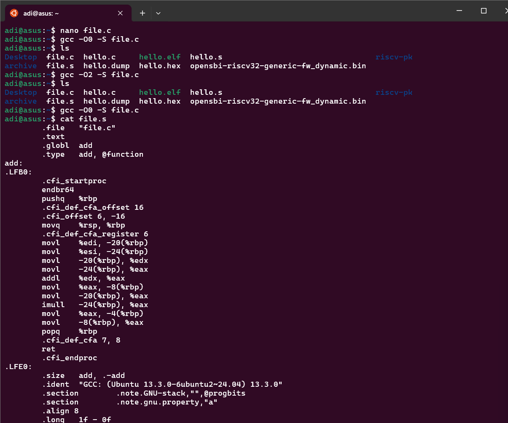
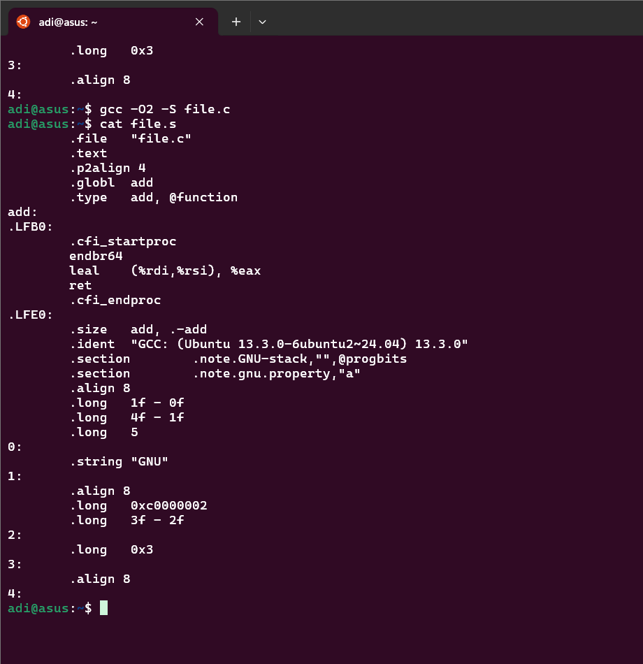

# Task 8: Exploring GCC Optimization (`-O0` vs `-O2`)

## Question

Compile the same file with `-O0` vs `-O2`. What differences appear in the assembly and why?

---

## Method

- Compile a C file twice with `gcc -O0 -S file.c` and `gcc -O2 -S file.c`.
- Compare the two `.s` assembly files side-by-side.
- Analyze differences in code size, instructions, and structure.
- Explain the effects of optimizations like dead-code elimination, register allocation, and function inlining.

---

# GCC Optimization Levels: `-O0` vs `-O2` Assembly Comparison

## Real Terminal Workflow Example

Below is a real workflow showing how to generate and inspect assembly for both optimization levels:

```sh
adi@asus:~$ nano file.c
adi@asus:~$ gcc -O0 -S file.c
adi@asus:~$ ls
Desktop  file.c  hello.c     hello.elf  hello.s  riscv-pk
archive  file.s  hello.dump  hello.hex  opensbi-riscv32-generic-fw_dynamic.bin
adi@asus:~$ gcc -O2 -S file.c
adi@asus:~$ ls
Desktop  file.c  hello.c     hello.elf  hello.s  riscv-pk
archive  file.s  hello.dump  hello.hex  opensbi-riscv32-generic-fw_dynamic.bin
adi@asus:~$ gcc -O0 -S file.c
adi@asus:~$ cat file.s
        .file   "file.c"
        .text
        .globl  add
        .type   add, @function
add:
.LFB0:
        .cfi_startproc
        endbr64
        pushq   %rbp
        .cfi_def_cfa_offset 16
        .cfi_offset 6, -16
        movq    %rsp, %rbp
        .cfi_def_cfa_register 6
        movl    %edi, -20(%rbp)
        movl    %esi, -24(%rbp)
        movl    -20(%rbp), %edx
        movl    -24(%rbp), %eax
        addl    %edx, %eax
        movl    %eax, -8(%rbp)
        movl    -20(%rbp), %eax
        imull   -24(%rbp), %eax
        movl    %eax, -4(%rbp)
        movl    -8(%rbp), %eax
        popq    %rbp
        .cfi_def_cfa 7, 8
        ret
        .cfi_endproc
.LFE0:
        .size   add, .-add
        .ident  "GCC: (Ubuntu 13.3.0-6ubuntu2~24.04) 13.3.0"
        .section        .note.GNU-stack,"",@progbits
        .section        .note.gnu.property,"a"
        .align 8
        .long   1f - 0f
        .long   4f - 1f
        .long   5
0:
        .string "GNU"
1:
        .align 8
        .long   0xc0000002
        .long   3f - 2f
2:
        .long   0x3
3:
        .align 8
4:
adi@asus:~$ gcc -O2 -S file.c
adi@asus:~$ cat file.s
        .file   "file.c"
        .text
        .p2align 4
        .globl  add
        .type   add, @function
add:
.LFB0:
        .cfi_startproc
        endbr64
        leal    (%rdi,%rsi), %eax
        ret
        .cfi_endproc
.LFE0:
        .size   add, .-add
        .ident  "GCC: (Ubuntu 13.3.0-6ubuntu2~24.04) 13.3.0"
        .section        .note.GNU-stack,"",@progbits
        .section        .note.gnu.property,"a"
        .align 8
        .long   1f - 0f
        .long   4f - 1f
        .long   5
0:
        .string "GNU"
1:
        .align 8
        .long   0xc0000002
        .long   3f - 2f
2:
        .long   0x3
3:
        .align 8
4:
adi@asus:~$
```


## Source Code (file.c)

```c
int add(int a, int b) {
    int x = a + b;
    int y = a * b;
    return x;
}
```

---

## Assembly Generated at `-O0`

```asm
add:
    pushq   %rbp
    movq    %rsp, %rbp
    movl    %edi, -20(%rbp)     # store parameter a
    movl    %esi, -24(%rbp)     # store parameter b
    movl    -20(%rbp), %edx
    movl    -24(%rbp), %eax
    addl    %edx, %eax          # x = a + b
    movl    %eax, -8(%rbp)      # store x on stack
    movl    -20(%rbp), %eax
    imull   -24(%rbp), %eax     # y = a * b (dead code, stored)
    movl    %eax, -4(%rbp)      # store y on stack
    movl    -8(%rbp), %eax      # load x to return
    popq    %rbp
    ret
```

* **Verbose**: All variables are stored on the stack.
* **Dead code included**: `y` (unused) is computed and stored.
* Lots of stack load/store instructions.
* Easier to debug — reflects source closely.

---

## Assembly Generated at `-O2`

```asm
add:
    leal    (%rdi,%rsi), %eax    # compute a + b directly in register eax
    ret                         # return immediately
```

* **Optimized**: Dead code (`y = a * b`) is eliminated.
* Variables stay in registers — no stack operations.
* Function reduced to one instruction plus return.
* Faster and smaller.

---


## Expanded Explanation

### What happens at `-O0` (No Optimization)?

- The compiler tries to preserve your source code structure as much as possible.
- Every variable is stored on the stack, and every line of C code is translated to assembly, even if it’s not needed for the result.
- Dead code (like `y = a * b;` when `y` is never used) is still computed and stored.
- This makes debugging easier, since the assembly closely matches your C code, but the code is much less efficient.

### What happens at `-O2` (Optimized)?

- The compiler analyzes your code and removes anything that doesn’t affect the output (dead-code elimination).
- Variables are kept in CPU registers as much as possible, reducing memory access (register allocation).
- The function is reduced to the minimum number of instructions needed to compute the result.
- If possible, the compiler will also inline small functions, unroll loops, and perform other optimizations to make the code faster and smaller.

### Why do these differences matter?

- **Debugging:** `-O0` is best for debugging because the code structure is preserved and variables are easy to inspect.
- **Performance:** `-O2` is best for production code because it runs faster and uses less memory.
- **Code size:** Optimized code is much smaller, which is important for embedded systems and performance-critical applications.

### Key Optimization Concepts

- **Dead-Code Elimination:** Removes code that does not affect the program’s output.
- **Register Allocation:** Keeps variables in registers instead of memory for faster access.
- **Inlining:** Replaces function calls with the function body to reduce call overhead.
- **Instruction Simplification:** Combines or removes unnecessary instructions.

---

---

## Output

