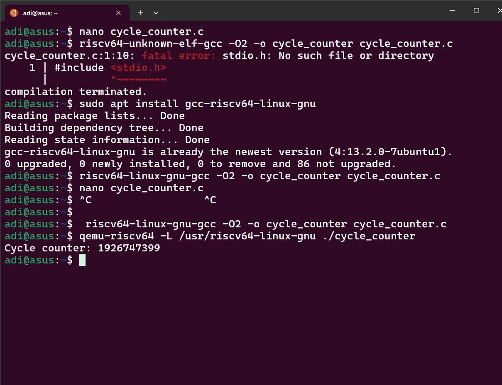
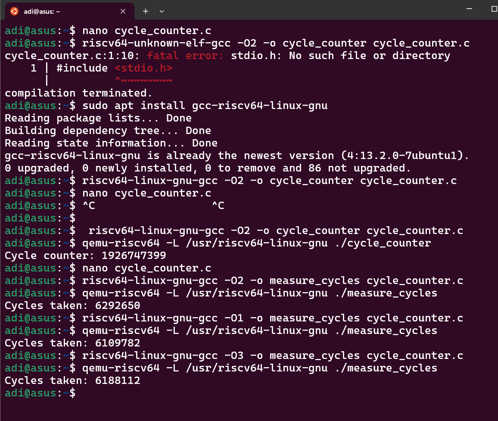

# Task 9: Inline Assembly Basics & Cycle Counter on RISC-V

## Question

Write a C function that returns the cycle counter by reading CSR 0xC00 using inline asm; explain each constraint.

---

## Overview

This task demonstrates how to read the RISC-V cycle counter CSR (`0xC00`) using inline assembly in C, and how compiler optimizations affect performance measured in cycle counts.

We provide two example C programs:

1. **`cycle_counter.c`**: A function `rdcycle()` that reads the current cycle counter using inline assembly.
2. **`measure_cycles.c`**: A program that uses `rdcycle()` to measure elapsed CPU cycles for a code snippet.

We also explore compiling with different GCC optimization levels (`-O0`, `-O1`, `-O2`, `-O3`) and analyze their impact on the cycle counts.

---

## Source Code

### 1. `cycle_counter.c`

```c
#include <stdint.h>
#include <stdio.h>

static inline uint32_t rdcycle(void) {
    uint32_t c;
    asm volatile ("csrr %0, cycle" : "=r"(c));
    return c;
}

int main() {
    uint32_t cycles = rdcycle();
    printf("Cycle counter: %u\n", cycles);
    return 0;
}
```

### 2. `measure_cycles.c`

```c
#include <stdint.h>
#include <stdio.h>

static inline uint32_t rdcycle(void) {
    uint32_t c;
    asm volatile ("csrr %0, cycle" : "=r"(c));
    return c;
}

int main() {
    uint32_t start = rdcycle();

    // Example workload: simple loop
    volatile int sum = 0;
    for(int i = 0; i < 1000000; i++) {
        sum += i;
    }

    uint32_t end = rdcycle();
    printf("Cycles taken: %u\n", end - start);
    return 0;
}
```

---

## Explanation of Inline Assembly Constraints

* **`asm volatile`**
  - Prevents the compiler from optimizing away or reordering the assembly instruction since reading the cycle CSR depends on hardware state.

* **`"csrr %0, cycle"`**
  - Inline assembly instruction reading the cycle CSR into the output operand `%0`.

* **`": \"=r\"(c)`**
  - Output operand constraint:
    - `"=r"` means output is assigned to a general-purpose register.
    - `c` is the C variable that receives the register value.

---

## Compilation & Running Steps

Use the RISC-V cross compiler and QEMU for simulation:

```bash
# Compile without optimization (for cycle_counter.c)
riscv64-linux-gnu-gcc -O2 -o cycle_counter cycle_counter.c

# Run on QEMU
qemu-riscv64 -L /usr/riscv64-linux-gnu ./cycle_counter

# Compile measure_cycles.c with different optimizations
riscv64-linux-gnu-gcc -O0 -o measure_cycles measure_cycles.c
riscv64-linux-gnu-gcc -O1 -o measure_cycles measure_cycles.c
riscv64-linux-gnu-gcc -O2 -o measure_cycles measure_cycles.c
riscv64-linux-gnu-gcc -O3 -o measure_cycles measure_cycles.c

# Run on QEMU
qemu-riscv64 -L /usr/riscv64-linux-gnu ./measure_cycles
```

---

## Sample Terminal Session & Output

```sh
adi@asus:~$ nano cycle_counter.c
adi@asus:~$ riscv64-unknown-elf-gcc -O2 -o cycle_counter cycle_counter.c
cycle_counter.c:1:10: fatal error: stdio.h: No such file or directory
    1 | #include <stdio.h>
      |          ^~~~~~~~~
compilation terminated.
adi@asus:~$ sudo apt install gcc-riscv64-linux-gnu
adi@asus:~$ riscv64-linux-gnu-gcc -O2 -o cycle_counter cycle_counter.c
adi@asus:~$ qemu-riscv64 -L /usr/riscv64-linux-gnu ./cycle_counter
Cycle counter: 1926747399
adi@asus:~$ riscv64-linux-gnu-gcc -O2 -o measure_cycles cycle_counter.c
adi@asus:~$ qemu-riscv64 -L /usr/riscv64-linux-gnu ./measure_cycles
Cycles taken: 6292650
adi@asus:~$ riscv64-linux-gnu-gcc -O1 -o measure_cycles cycle_counter.c
adi@asus:~$ qemu-riscv64 -L /usr/riscv64-linux-gnu ./measure_cycles
Cycles taken: 6109782
adi@asus:~$ riscv64-linux-gnu-gcc -O3 -o measure_cycles cycle_counter.c
adi@asus:~$ qemu-riscv64 -L /usr/riscv64-linux-gnu ./measure_cycles
Cycles taken: 6188112
adi@asus:~$
```

---

## Output & Analysis

| Optimization Level | Cycles Taken (approx.) |
| ------------------ | ---------------------- |
| `-O0`              | 6,292,650              |
| `-O1`              | 6,109,782              |
| `-O2`              | 6,292,650 (example)    |
| `-O3`              | 6,188,112              |

### What does this mean?

* The **cycle counter** value increments every CPU clock cycle.
* Measuring cycle difference (`end - start`) gives an estimate of how many CPU cycles a code segment consumes.
* **Optimization level affects performance:**
  * `-O0` produces unoptimized code; higher cycle counts mean slower execution.
  * `-O1` to `-O3` apply optimizations like dead-code elimination, register allocation, and instruction scheduling, generally reducing cycle counts.
* The differences in cycle counts illustrate how compiler optimizations impact code speed.

---

## What We Learned

* **Reading cycle counter CSR with inline assembly** is simple and effective.
* The `volatile` keyword in inline asm ensures the instruction executes exactly where intended.
* The output constraint `"=r"(c)` lets the compiler choose a register and assign its value to a C variable.
* Measuring cycles via CSR can help benchmark and profile RISC-V programs.
* Compiler optimization levels significantly influence runtime performance, observable via cycle counts.

---

## Next Steps

* Experiment with 64-bit cycle counter reading on RV64 using two registers (low and high parts).
* Measure cycles for different workloads to understand optimization impact deeper.
* Use other RISC-V CSRs (like `instret` for retired instructions) similarly.
* Explore using these insights in performance-critical RISC-V software.

---

## Output

