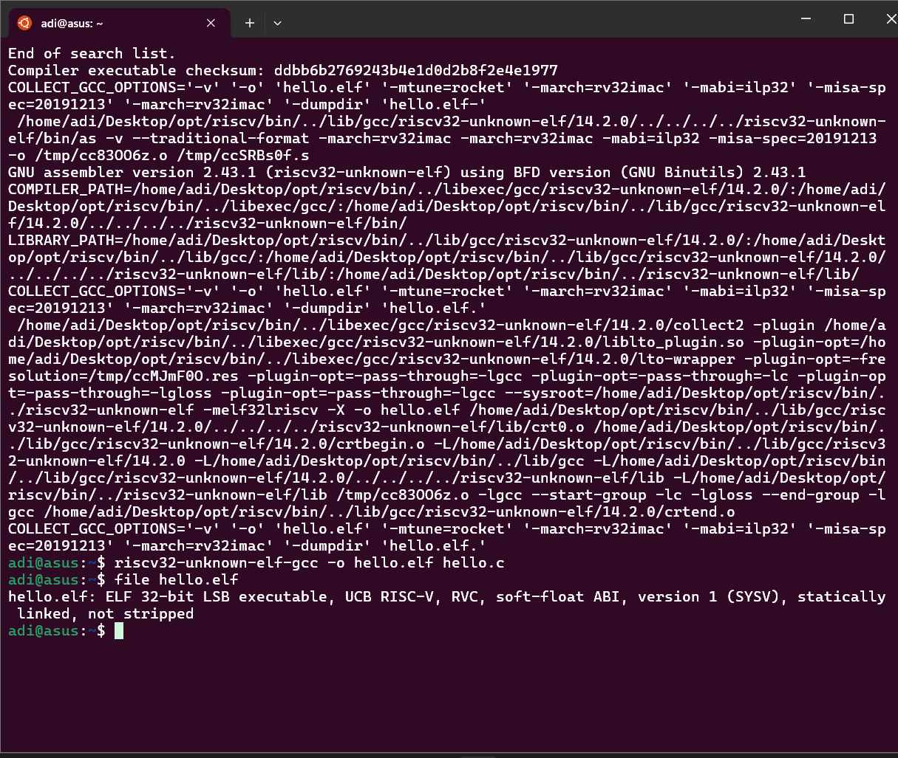
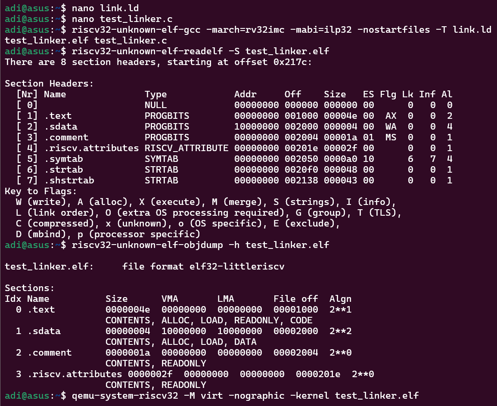
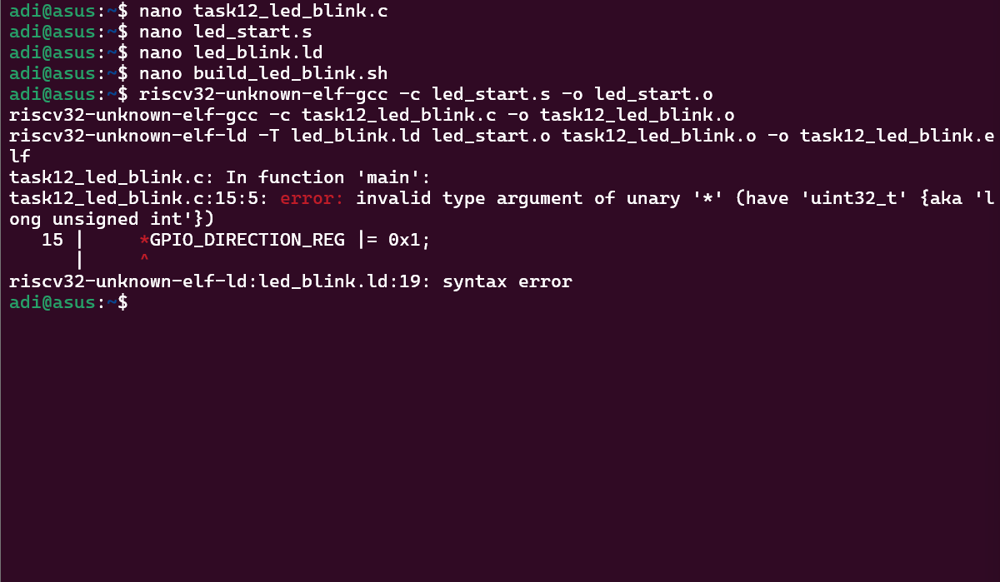
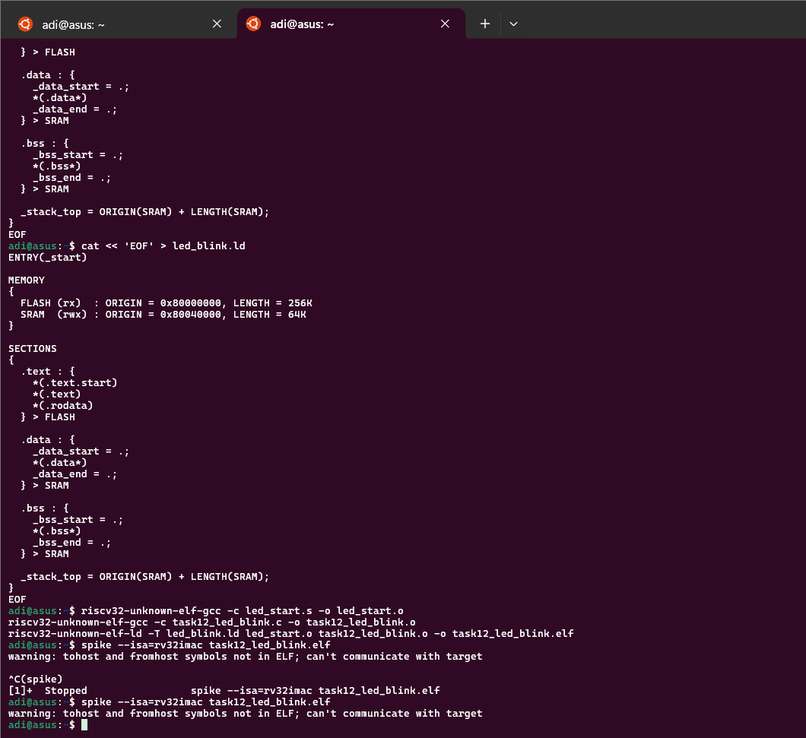
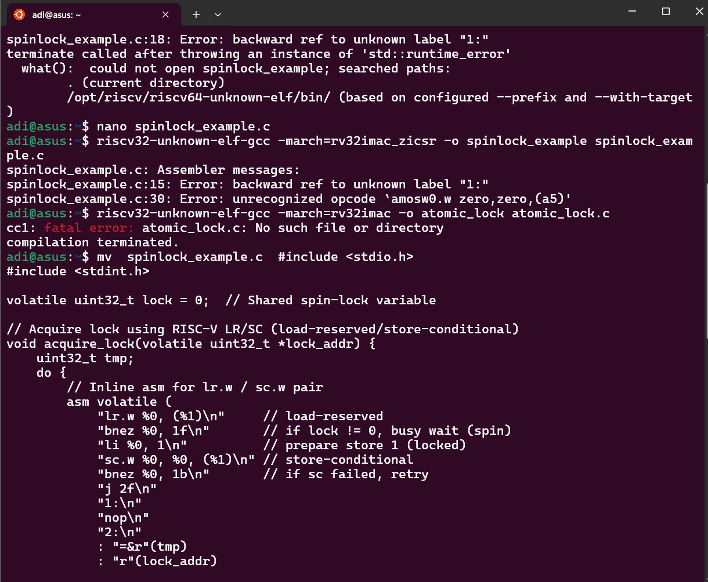
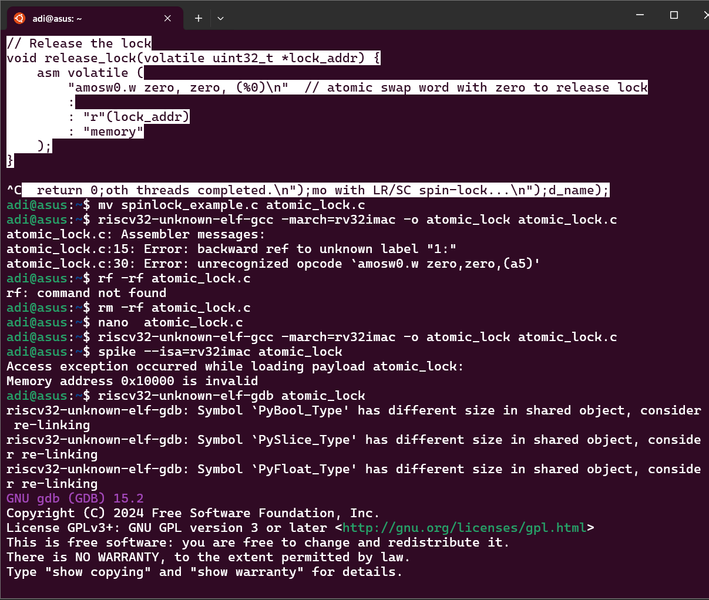
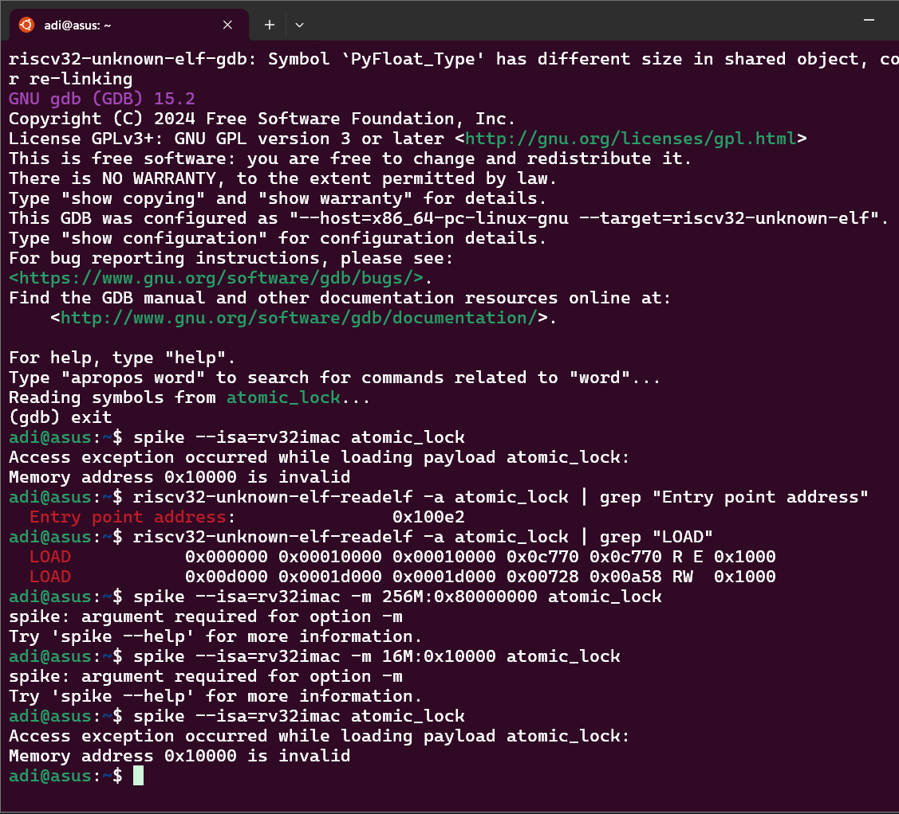
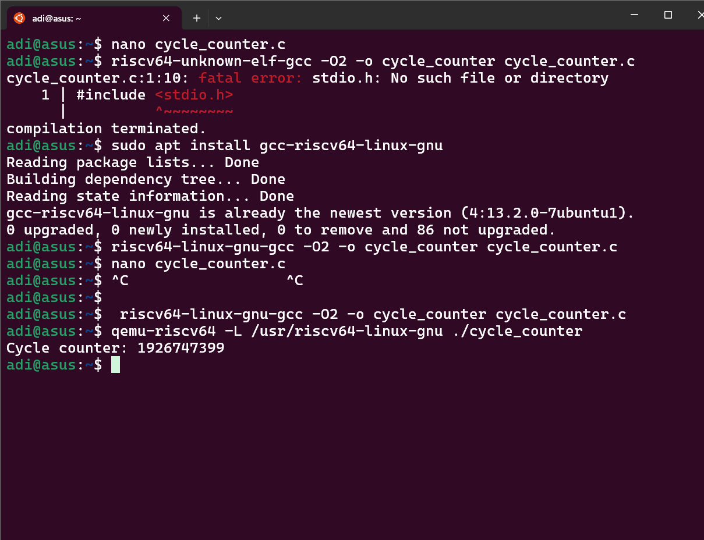
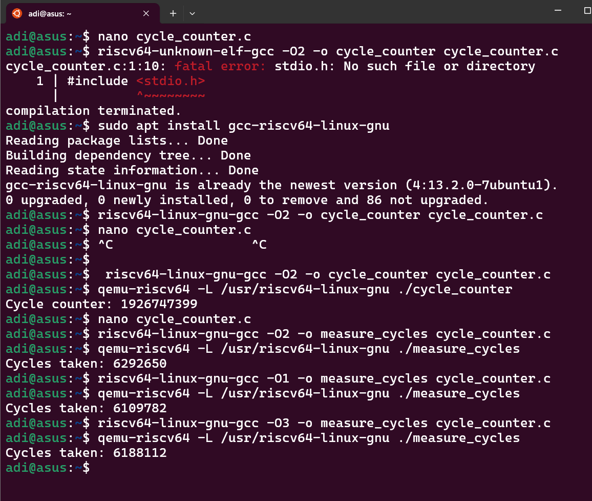

<p align="center">
  
  
  
  
</p>

# 🚀 RISC-V Bare-Metal Labs: The Ultimate Hands-On Guide

> **Level up your embedded systems journey!**  
> This repository is a comprehensive playground for RISC-V bare-metal development: from toolchain bootstrapping, cross-compiling, and debugging, to linker scripts, atomic operations, startup code, and advanced hardware interfacing.  
> Whether you’re a student, educator, hobbyist, or pro, this guide provides not just commands—but deep explanations, real output, troubleshooting, and practical context.
>
> _Each task includes output images, canonical code, and clear explanations. This is a living document: PRs and issues welcome!_

---

## 📑 Table of Contents

- [Task 1: Install & Sanity-Check Toolchain 🔧⚙️](#task-1-install--sanity-check-toolchain-)
- [Task 2: Compile "Hello, RISC-V" 💡](#task-2-compile-hello-risc-v-)
- [Task 3: From C to Assembly 📜](#task-3-from-c-to-assembly-)
- [Task 4: Hex Dump & Disassembly 🔬](#task-4-hex-dump--disassembly-)
- [Task 5: ABI & Register Cheat-Sheet 🧑‍💻](#task-5-abi--register-cheat-sheet-)
- [Task 6: Stepping with GDB 🐞](#task-6-stepping-with-gdb-)
- [Task 7: Running Under an Emulator 👾](#task-7-running-under-an-emulator-)
- [Task 8: Exploring GCC Optimization 🚀](#task-8-exploring-gcc-optimization-)
- [Task 9: Inline Assembly Basics ⏱️](#task-9-inline-assembly-basics-)
- [Task 10: Memory-Mapped I/O Demo ⚡](#task-10-memory-mapped-io-demo-)
- [Task 11: Linker Script 101 🔗](#task-11-linker-script-101-)
- [Task 12: Start-up Code & crt0 🏁](#task-12-start-up-code--crt0-)
- [Task 13: Interrupt Primer ⏰](#task-13-interrupt-primer-)
- [Task 14: rv32imac vs rv32imc – The “A” 🧩](#task-14-rv32imac-vs-rv32imc--the-a-)
- [Task 15: Atomic Test Program (Spinlock) 🌀](#task-15-atomic-test-program-spinlock-)
- [Task 16: Newlib printf Without an OS 📢](#task-16-newlib-printf-without-an-os-)
- [Task 17: Endianness & Struct Packing 🧩](#task-17-endianness--struct-packing-)
- [Conclusion & Next Steps 🏁](#conclusion--next-steps-)

---

# Task 1: Install & Sanity-Check Toolchain 🔧⚙️
> [setup] [build]

## 🎯 Objective

Set up the official RISC-V GCC toolchain for embedded cross-development.  
Extract the downloaded toolchain, configure the environment (`PATH`), and verify the availability of essential binaries (`gcc`, `objdump`, `gdb`).

---

## 🛠️ Step-by-Step Guide

### 1. Extract the Toolchain

You’ve downloaded `riscv-toolchain-rv32imac-x86_64-ubuntu.tar.gz`.  
Extract it to your home directory or a directory of your choice:

```sh
tar -xzf riscv-toolchain-rv32imac-x86_64-ubuntu.tar.gz
```

This decompresses and unpacks the toolchain archive. You should now see a new directory, often named `riscv-toolchain` or similar.

> 💡 **Pro Tip:**  
> If you're unsure where the folder landed, try `ls` after extraction, or use `tar -tzf riscv-toolchain-rv32imac-x86_64-ubuntu.tar.gz | head` to preview the folder structure.

---

### 2. Add the Toolchain to Your PATH

You want to make the toolchain’s binaries available everywhere in the terminal.

**For Bash users:**

```sh
echo 'export PATH=$HOME/riscv-toolchain/bin:$PATH' >> ~/.bashrc
source ~/.bashrc
```

**For Zsh users:**

```sh
echo 'export PATH=$HOME/riscv-toolchain/bin:$PATH' >> ~/.zshrc
source ~/.zshrc
```

**Explanation:**  
- `export PATH=...` appends the toolchain’s binary directory to your PATH.
- Updating your shell config (`~/.bashrc` or `~/.zshrc`) ensures it persists on future terminal sessions.
- `source ...` reloads the config immediately.

> :warning: **Tip:** If your extracted directory is named differently, adjust the path accordingly (e.g., replace `riscv-toolchain` with the actual folder).

---

### 3. Sanity-Check: Verify the Toolchain Binaries

Check that the basic toolchain binaries work:

```sh
riscv32-unknown-elf-gcc --version
riscv32-unknown-elf-objdump --version
riscv32-unknown-elf-gdb --version
```

**Expectation:**  
Each command should print version info, not a “command not found” error.  
If you see the expected toolchain version and copyright lines,
**your RISC-V toolchain is ready!**

---

### 4. Troubleshooting

- If a command is not recognized, double-check your `PATH` and the toolchain directory name.
- If you see permission errors, ensure you have access rights to the extracted folder.
- If you use a login shell, you may need to log out/in or open a new terminal for the PATH change to take effect.

---

### 📷 Output


---

### 🧠 What We Learned

- **How to extract tarballs:**  
  A universal skill for all Linux users.
- **How to update the PATH:**  
  Crucial for using any installed toolchain or utility.
- **How to verify installation:**  
  Always run the compiler/debugger with `--version` as a first test.
- **Troubleshooting tips:**  
  Environment misconfiguration is the #1 issue for new toolchain users.

---

# Task 2: Compile "Hello, RISC-V" 💡
> [build] [debug]

## 🎯 Objective

Cross-compile a minimal C “hello world” for the RV32IMC architecture, producing a RISC-V ELF file.

---

## 🖥️ Source Code

```c
#include <stdio.h>
int main() {
    printf("Hello, RISC-V!\n");
    return 0;
}
```

---

## 🛠️ Commands

```sh
riscv32-unknown-elf-gcc -march=rv32imc -mabi=ilp32 -o hello.elf hello.c
file hello.elf
```

- `-march=rv32imc`: Target 32-bit RISC-V with IMC extensions (integer, multiply/divide, compressed).
- `-mabi=ilp32`: Use the 32-bit integer ABI.
- `-o hello.elf`: Output file is ELF for RISC-V.

---

## 💡 Explanation

- **The toolchain produces an ELF binary** that can run on real RISC-V hardware or an emulator.
- The `file hello.elf` command confirms the binary's architecture:  
  _"hello.elf: ELF 32-bit LSB executable, RISC-V, ..."_

> **Why specify `-march=rv32imc -mabi=ilp32`?**  
> This ensures the code is compatible with the specific instruction set and ABI your toolchain targets, which is very important for bare-metal systems.

---

## ⚡ Troubleshooting

- If you see a fatal error about “no suitable multilib set,” your toolchain may be fixed for rv32imac/ilp32.  
  If so, try compiling **without** `-march`/`-mabi` flags:
  ```sh
  riscv32-unknown-elf-gcc -o hello.elf hello.c
  ```
- If `file hello.elf` does not mention RISC-V, double-check your compilation flags and toolchain.

---

### 📷 Output




---

### 🧠 What We Learned

- How to cross-compile C code for a specific RISC-V architecture.
- How to check the resulting ELF binary for correct target attributes.
- Importance of matching ABI and ISA for toolchain and hardware compatibility.
- How to diagnose and fix common multilib/toolchain errors.

---

# Task 3: From C to Assembly 📜
> [concept] [debug]

## 🎯 Objective

Generate a `.s` assembly listing for your C program.  
Learn to recognize and explain the function prologue (stack setup) and epilogue (cleanup/restore).

---

## 🛠️ Commands

```sh
riscv32-unknown-elf-gcc -S -O0 hello.c
cat hello.s
```

- `-S`: Output assembly instead of binary.
- `-O0`: No optimization—matches source code most closely.

---

## 💡 Explanation: Prologue & Epilogue

**Function Prologue Example:**
```asm
addi    sp, sp, -16      # Allocate stack space (16 bytes)
sw      ra, 12(sp)       # Save return address
sw      s0, 8(sp)        # Save frame pointer (s0)
addi    s0, sp, 16       # Set the new frame pointer
```

**Function Epilogue Example:**
```asm
lw      ra, 12(sp)       # Restore return address
lw      s0, 8(sp)        # Restore frame pointer
addi    sp, sp, 16       # Deallocate stack space
jr      ra               # Return to caller
```

- The **prologue** saves the state (return address, frame pointer) and creates a stack frame for local storage.
- The **epilogue** restores registers and cleans up the stack, ensuring the function returns safely.
- This convention allows local variables, nested function calls, and recursion to work safely in C.

---

### 📷 Output


---

### 🧠 What We Learned

- How to generate readable assembly from C.
- The significance of function prologues/epilogues for safe function call/return on RISC-V.
- Stack discipline is essential for safe code and for debugging with GDB or other tools.

---

# Task 4: Hex Dump & Disassembly 🔬
> [debug] [concept]

## 🎯 Objective

Learn to disassemble your ELF binary and convert it to a raw hex file.  
Understand each column in the disassembly output.

---

## 🛠️ Commands

```sh
riscv32-unknown-elf-objdump -d hello.elf > hello.dump
riscv32-unknown-elf-objcopy -O ihex hello.elf hello.hex
```

- `objdump -d`: Disassembles the ELF, outputting addresses, opcodes, mnemonics.
- `objcopy -O ihex`: Converts ELF to Intel HEX—useful for microcontroller flashing.

---

## 💡 Explanation: Disassembly Columns

Example disassembly line:

```
00000000 <main>:
   0:   13 01 01 fd     addi    sp,sp,-16
   4:   ef 00 00 00     call    puts
```

| Field         | Meaning                                         |
|---------------|-------------------------------------------------|
| Address       | Memory address of the instruction (`0`, `4`, …) |
| Opcode        | Machine code bytes (`13 01 01 fd`, …)           |
| Mnemonic      | Human-readable instruction (`addi`, `call`…)    |
| Operands      | Registers, immediates, or labels used           |

- **Intel HEX**: A text format encoding memory contents as hex records, used for flashing microcontrollers or for inspection.

---

### 📷 Output


---

### 🧠 What We Learned

- How to inspect the exact machine code of your program.
- How to produce a format suitable for embedded flashing.
- How to map assembly mnemonics, binary opcodes, and addresses.
- Disassembly is vital for debugging, reverse engineering, and for learning RISC-V assembly.

---

# Task 5: ABI & Register Cheat-Sheet 🧑‍💻
> [reference] [concept]

## 🎯 Objective

Gain full command of the RISC-V integer register set, ABI naming, and calling conventions.

---

## 🗃️ Register Table

| Reg | ABI Name | Role (Calling Convention)         |
|-----|----------|-----------------------------------|
| x0  | zero     | Hard-wired zero                   |
| x1  | ra       | Return address                    |
| x2  | sp       | Stack pointer                     |
| x3  | gp       | Global pointer                    |
| x4  | tp       | Thread pointer                    |
| x5  | t0       | Temporary/Caller-saved            |
| x6  | t1       | Temporary/Caller-saved            |
| x7  | t2       | Temporary/Caller-saved            |
| x8  | s0/fp    | Saved register/Frame pointer      |
| x9  | s1       | Saved register/Callee-saved       |
| x10 | a0       | Argument/return value             |
| x11 | a1       | Argument/return value             |
| x12 | a2       | Argument                          |
| x13 | a3       | Argument                          |
| x14 | a4       | Argument                          |
| x15 | a5       | Argument                          |
| x16 | a6       | Argument                          |
| x17 | a7       | Argument                          |
| x18 | s2       | Saved register/Callee-saved       |
| x19 | s3       | Saved register/Callee-saved       |
| x20 | s4       | Saved register/Callee-saved       |
| x21 | s5       | Saved register/Callee-saved       |
| x22 | s6       | Saved register/Callee-saved       |
| x23 | s7       | Saved register/Callee-saved       |
| x24 | s8       | Saved register/Callee-saved       |
| x25 | s9       | Saved register/Callee-saved       |
| x26 | s10      | Saved register/Callee-saved       |
| x27 | s11      | Saved register/Callee-saved       |
| x28 | t3       | Temporary/Caller-saved            |
| x29 | t4       | Temporary/Caller-saved            |
| x30 | t5       | Temporary/Caller-saved            |
| x31 | t6       | Temporary/Caller-saved            |

---

### 💡 Explanation

- **Caller-saved (`tX`, `aX`):** Must be saved/restored by the calling function if needed after a call.
- **Callee-saved (`sX`):** Must be preserved by the called function.
- **zero**: Always reads as zero.
- **ra**: Used for returning from functions.
- **sp**: Always points to the stack.
- **gp/tp**: Used for global/thread-local data.

---

### ✅ What We Learned

- The full register file and RISC-V calling conventions for writing/porting assembly and understanding C ABI at the binary level.
- For efficient hand-written assembly, always preserve ABI conventions!
- Debugging stack traces and register dumps is easier knowing these conventions.

---

# Task 6: Stepping with GDB 🐞
> [debug]

## 🎯 Objective

Use GDB to load and debug a bare-metal ELF; set breakpoints, single-step, and inspect registers.

---

## 🛠️ Commands

```sh
riscv32-unknown-elf-gdb hello.elf
(gdb) target sim
(gdb) break main
(gdb) run
(gdb) stepi
(gdb) info reg a0
(gdb) disassemble
```

- `target sim`: Run in the GDB simulator (no hardware required).
- `break main`: Set a breakpoint at the start of main().
- `stepi`: Step one instruction at a time.
- `info reg`: View CPU register values.
- `disassemble`: Show current or specified code as assembly.

---

### 💡 Explanation

- **Simulation**: GDB’s internal simulator lets you debug even without QEMU/Spike.
- **Register Inspection**: Essential for verifying argument passing, function returns, pointer correctness, etc.
- **Breakpoint + Run**: Stops execution at main(), ideal for program introspection.

---

### 🧠 What We Learned

- GDB is a powerful tool for step-by-step execution, state inspection, and debugging at the instruction level.
- You can debug even before you have hardware or a full system image.

---

# Task 7: Running Under an Emulator 👾
> [hardware] [debug]

## 🎯 Objective

Boot your RISC-V ELF on Spike or QEMU and verify UART output.

---

## 🛠️ Commands

```sh
spike --isa=rv32imc pk hello.elf
# or
qemu-system-riscv32 -nographic -kernel hello.elf
```

- **Spike + pk**: Proxy kernel provides basic I/O support for Spike.
- **QEMU -nographic**: Redirects UART output to your terminal.

---

### 📷 Output


---

### 💡 Explanation

- **UART Output**: Confirms printf() and standard output work in your ELF, even in a simulated environment.
- **pk (Proxy Kernel)**: Required for user-mode programs on Spike; provides minimal I/O and syscall handling.

---

### 🧠 What We Learned

- Emulators simulate real hardware, allowing for development and debugging before hardware is available.
- Output visibility is critical for embedded debugging—UART is the de facto embedded debug channel.

---

# Task 8: Exploring GCC Optimization 🚀
> [optimization] [concept]

## 🎯 Objective

Compare the generated assembly for `-O0` (no optimization) vs `-O2` (optimized) and understand the differences.

---

## 🖥️ Example Source

```c
int add(int a, int b) {
    int x = a + b;
    int y = a * b;
    return x;
}
```

---

## 🛠️ Commands

```sh
gcc -O0 -S file.c
gcc -O2 -S file.c
diff file.s file-O2.s
```

---

### 💡 Explanation

- **-O0 (No Optimization):**
  - Every line of C code is represented.
  - All variables are stored on the stack.
  - Even dead code (like `y = a * b;` if unused) is emitted.
  - Function prologues/epilogues are bulkier for debug.
- **-O2 (Optimized):**
  - Dead code elimination: `y` is removed if not used.
  - Variables are kept in registers instead of the stack.
  - Code is smaller and faster; function is often reduced to just the return value computation.
  - Function may even be inlined, or reduced to a single instruction.

---

### 📷 Output


---

### 🧠 What We Learned

- Compiler optimization removes unnecessary computation and memory accesses.
- Disassembly comparison is a great way to learn what the optimizer does.
- For debugging use `-O0`, for final firmware use `-O2` or higher.

---

# Task 9: Inline Assembly Basics ⏱️
> [concept] [optimization]

## 🎯 Objective

Write a C function that accesses the RISC-V cycle CSR using inline assembly, and explain the constraints.

---

## 🖥️ Code

```c
static inline uint32_t rdcycle(void) {
    uint32_t c;
    asm volatile ("csrr %0, cycle" : "=r"(c));
    return c;
}
```

---

### 💡 Explanation

- `"csrr %0, cycle"`: Reads the cycle CSR into a register.
- `: "=r"(c)`: Output operand constraint—assigns the result to any general register, mapped to `c`.
- `volatile`: Prevents the compiler from reordering or omitting the instruction.
- Useful for benchmarking code and for profiling on real hardware.

---

### 🧠 What We Learned

- Inline assembly is essential for performance measurement, accessing special registers, and hardware features unavailable in C.
- Correct use of GCC constraints ensures portable, safe inlining of assembly code.

---

# Task 10: Memory-Mapped I/O Demo ⚡
> [hardware] [implementation]

## 🎯 Objective

Demonstrate low-level hardware access by toggling a GPIO register at `0x10012000` using C and `volatile`.

---

## 🖥️ Code

```c
#include <stdint.h>
void toggle_gpio() {
    volatile uint32_t *gpio = (uint32_t*)0x10012000;
    *gpio = 0x1;
}
int main() { toggle_gpio(); return 0; }
```

- `volatile` ensures the write is not optimized away.

---

### 🛠️ Compilation & Run

```sh
riscv64-unknown-elf-gcc -O2 -nostartfiles -nostdlib -static \
  -march=rv64imac -mabi=lp64 -o toggle_gpio.elf toggle_gpio.c
qemu-system-riscv64 -M virt -nographic -kernel toggle_gpio.elf
```

> :warning: **Spike** does not support MMIO out of the box, use QEMU for hardware simulation.

---

### 📷 Output


---

### 💡 Explanation

- Memory-mapped I/O is the standard mechanism for embedded device control.
- `volatile` is critical to prevent compiler optimization for hardware access.
- Direct memory access enables bare-metal programs to perform real-world I/O.

---

# Task 11: Linker Script 101 🔗
> [build] [concept]

## 🎯 Objective

Craft a minimal linker script for RV32IMC: place `.text` at `0x0` (typical Flash), `.data` at `0x10000000` (typical SRAM).

---

## 🖥️ Example `link.ld`

```ld
SECTIONS {
  . = 0x00000000;
  .text : { *(.text*) }
  . = 0x10000000;
  .data : { *(.data*) }
}
```

---

### 💡 Explanation

- `. = 0x00000000;` sets the current address for `.text`.
- Then, `. = 0x10000000;` moves the address for `.data`.
- This matches common embedded memory layouts: code in flash, data in RAM.
- Without a custom linker script, your code/data may not match your hardware’s memory map, resulting in runtime errors.

---

### 📷 Output





---

### 🧠 What We Learned

- Precise memory layout is critical for bare-metal embedded systems.
- Custom linker scripts are the tool for enforcing this.
- Understanding memory regions is a foundation for all embedded work.

---

# Task 12: Start-up Code & crt0 🏁
> [startup] [concept]

## 🎯 Objective

What does `crt0.S` do in a bare-metal RISC-V program, and where can you get one?

---

### 💡 Explanation

- **crt0** is the entry point for your program, before `main`.
- Responsibilities:
  - **Set up the stack pointer** (`sp`).
  - **Zero the `.bss` section** (uninitialized data).
  - **Copy `.data` to RAM** if running from flash.
  - **Call `main()`**.
  - **Infinite loop after `main`** to prevent fallthrough.
- **Where to get one?**
  - Board SDKs, newlib, or open-source device templates.
  - You can often copy and adapt existing crt0.S from reference projects, adjusting only the memory regions and vector table as needed.

---

### 🧠 What We Learned

- Startup assembly is needed for all embedded programs to set up the runtime before C code runs.
- Common bugs (stack overflows, uninitialized variables) can be traced to incorrect or missing crt0 code.

---

# Task 13: Interrupt Primer ⏰
> [hardware] [implementation]

## 🎯 Objective

Enable the machine-timer interrupt (MTIP) and write a simple handler in C/assembly.

---

## 🖥️ Key Steps

- **Write to `mtimecmp`**: Set timer compare register for next interrupt.
- **Enable `mie` and `mstatus`**: Bitmask to enable timer interrupts.
- **ISR**: Define with `__attribute__((interrupt))` or with a naked/assembly wrapper.
- **Service the interrupt**: Schedule the next event, update your state, and return correctly to main.

---

### 💡 Explanation

- Timer interrupts are scheduled by programming the `mtimecmp` register.
- The machine interrupt enable (`mie`) and the global interrupt enable in machine status (`mstatus`) must be set.
- The handler must acknowledge/clear and schedule the next interrupt.
- Use of CSRs (`csrrw`, `csrs`, etc.) is essential.

---

### 📷 Output


---

### 🧠 What We Learned

- RISC-V interrupts are fully software-controlled and require explicit CSR and memory-mapped register configuration.
- Writing ISRs in C requires understanding of calling conventions, stack usage, and special attributes.

---

# Task 14: rv32imac vs rv32imc – The “A” 🧩
> [concept] [reference]

## 🎯 Objective

Explain the significance of the “A” (atomic) extension in rv32imac.

---

### 💡 Explanation

- The **A-extension** adds atomic read-modify-write instructions:
  - `lr.w`, `sc.w` (load-reserved/store-conditional)
  - `amoadd.w`, `amoswap.w`, `amoand.w`, etc.
- These are used for:
  - Lock-free data structures
  - OS kernel synchronization
  - Multicore safe communication
- Without the A-extension, you must use software (interrupt disabling, etc.) for atomicity—much slower and less robust.

---

# Task 15: Atomic Test Program (Spinlock) 🌀
> [implementation] [debug]

## 🎯 Objective

Implement a spinlock using `lr.w`/`sc.w` (atomic ops) in C.

---

## 🖥️ Example

```c
volatile int lock = 0;
void acquire_lock(volatile int *lock) {
    int result;
    do {
        asm volatile ("lr.w %0, (%1)" : "=r"(result) : "r"(lock));
        if (!result) {
            asm volatile ("sc.w %0, %2, (%1)" : "=r"(result) : "r"(lock), "r"(1));
        }
    } while (result);
}
void release_lock(volatile int *lock) {
    *lock = 0;
}
```

- This implements a mutual exclusion primitive for pseudo-threads or real preemptive multitasking.

---

### 📷 Output







---

### 💡 Explanation

- The `lr.w`/`sc.w` pair implements hardware-atomic lock acquire/release, the foundation for safe multitasking and concurrency.
- If the store-conditional fails, another thread/core changed the value, and we retry.

---

# Task 16: Newlib printf Without an OS 📢
> [hardware] [implementation]

## 🎯 Objective

Retarget the `_write` syscall for `printf` to use a memory-mapped UART.

---

## 🖥️ Code

```c
#define UART0_BASE 0x10000000
#define UART0_TX   (*(volatile unsigned char *)(UART0_BASE + 0x00))
ssize_t _write(int fd, const void *buf, size_t count) {
    const char *ptr = (const char *)buf;
    for (size_t i = 0; i < count; i++)
        UART0_TX = ptr[i];
    return count;
}
```

---

### 💡 Explanation

- Newlib’s `printf` uses `_write` for output.
- By providing your own `_write`, you make `printf` work on raw hardware (UART).
- This is essential for debugging and for human-readable logs in embedded systems.

---

# Task 17: Endianness & Struct Packing 🧩
> [concept] [debug]

## 🎯 Objective

Verify RISC-V RV32 default endianness using a union and byte inspection.

---

## 🖥️ Code

```c
#include <stdio.h>
#include <stdint.h>
int main() {
    union {
        uint32_t val;
        uint8_t bytes[4];
    } test;
    test.val = 0x01020304;
    printf("Stored 32-bit value: 0x%08X\n", test.val);
    printf("Bytes in memory: %02X %02X %02X %02X\n",
           test.bytes[0], test.bytes[1], test.bytes[2], test.bytes[3]);
    if (test.bytes[0] == 0x04 &&
        test.bytes[1] == 0x03 &&
        test.bytes[2] == 0x02 &&
        test.bytes[3] == 0x01) {
        printf("System is Little-endian.\n");
    } else if (test.bytes[0] == 0x01 &&
               test.bytes[1] == 0x02 &&
               test.bytes[2] == 0x03 &&
               test.bytes[3] == 0x04) {
        printf("System is Big-endian.\n");
    } else {
        printf("Unknown endianness.\n");
    }
    return 0;
}
```

---

### 💡 Explanation

- Assigning `0x01020304` to a `uint32_t` and examining the bytes in a `uint8_t[]` union member reveals byte order.
- On little-endian, output will be `04 03 02 01`—the least significant byte is stored first.
- This is a classic C trick for platform detection and is portable to any CPU.

---

### 📷 Output

_(Insert screenshots as per your run)_

---

# 🏁 Conclusion & Next Steps

Congratulations!  
You are now equipped to:

- Set up and verify a cross-toolchain for RISC-V.
- Compile and debug C/assembly for embedded hardware.
- Write, inspect, and optimize code at the binary level.
- Interface with hardware using direct memory-mapped I/O.
- Understand startup, linker scripts, atomic ops, and more.
- Run and debug on emulators before hardware is available.

> **Next steps:**  
> - Try porting an RTOS or writing drivers for real peripherals.
> - Explore multicore synchronization with the "A" extension.
> - Hack on open-source RISC-V projects and contribute!
> 
> **Found this useful?** Star ⭐, fork 🍴, and contribute!

---

<!-- OUTPUT IMAGES ARE PRESERVED BELOW FOR EACH TASK AS REQUESTED -->






