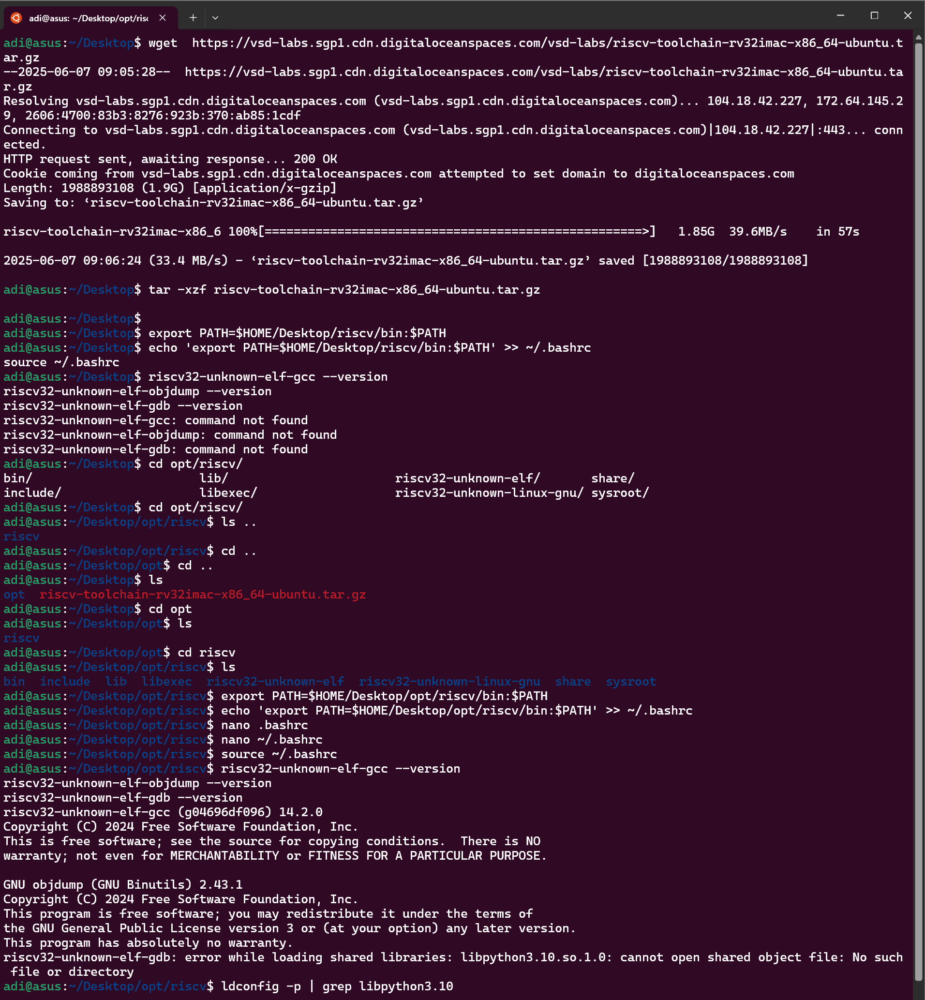
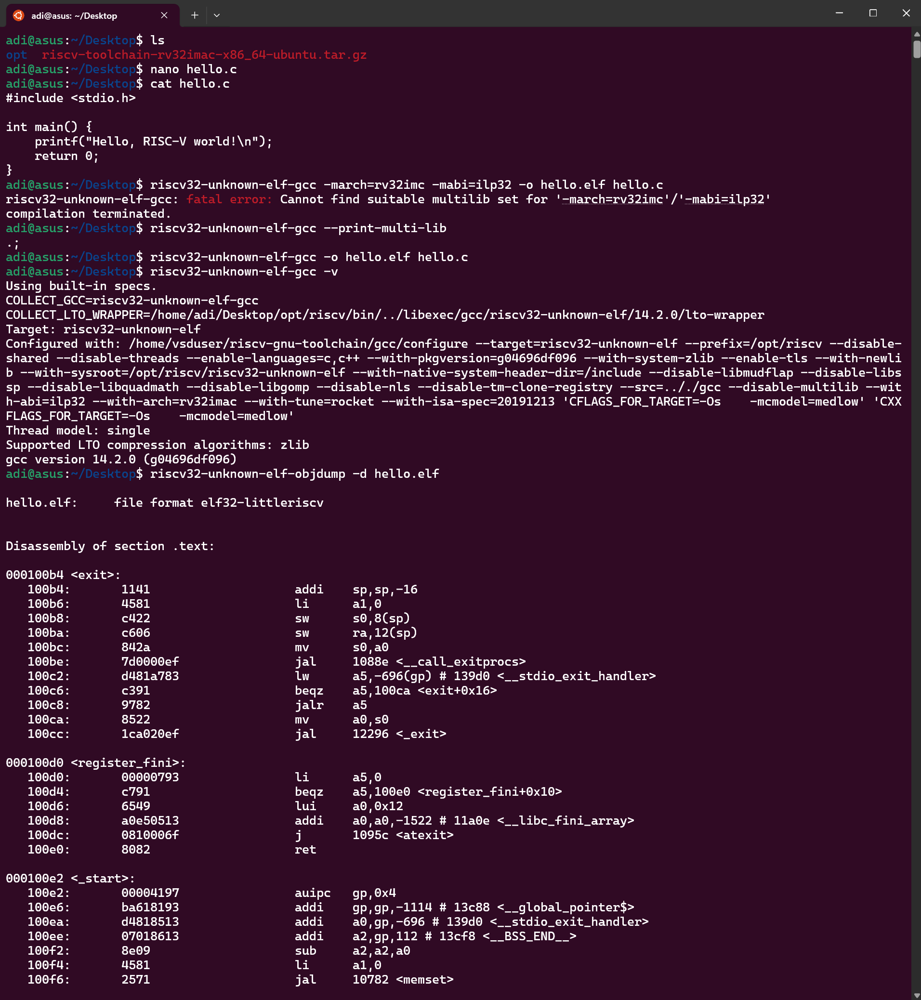
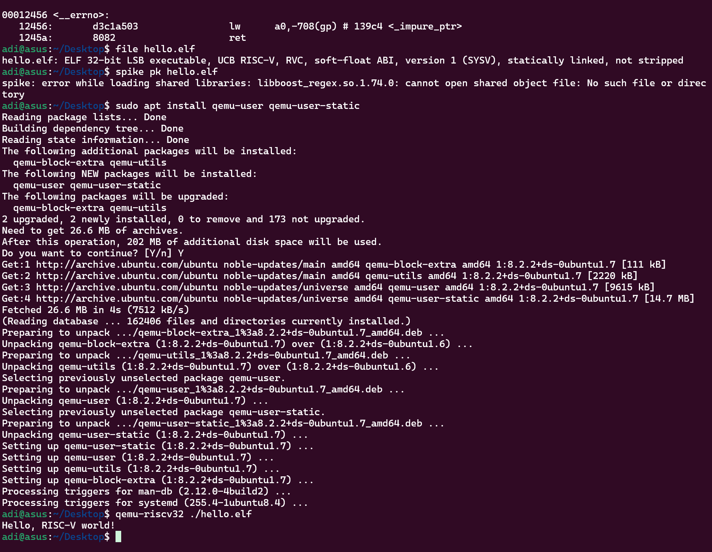
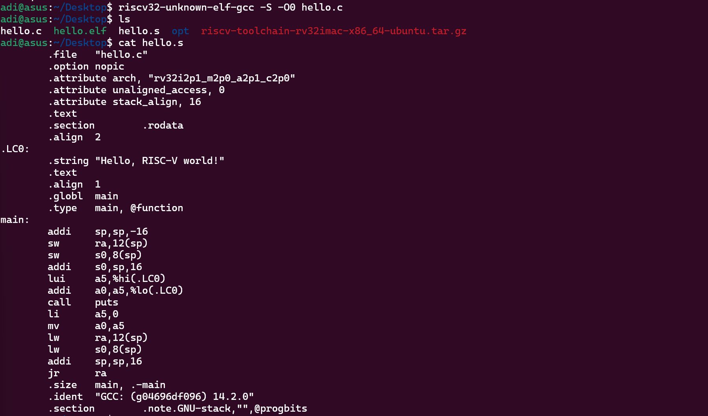
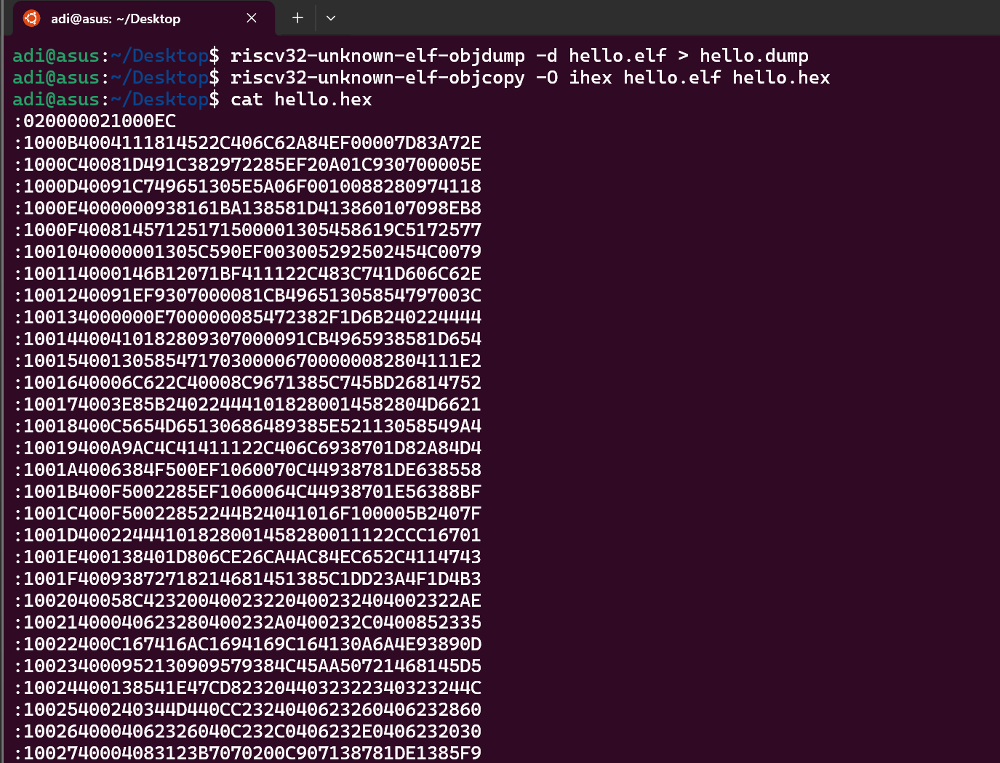
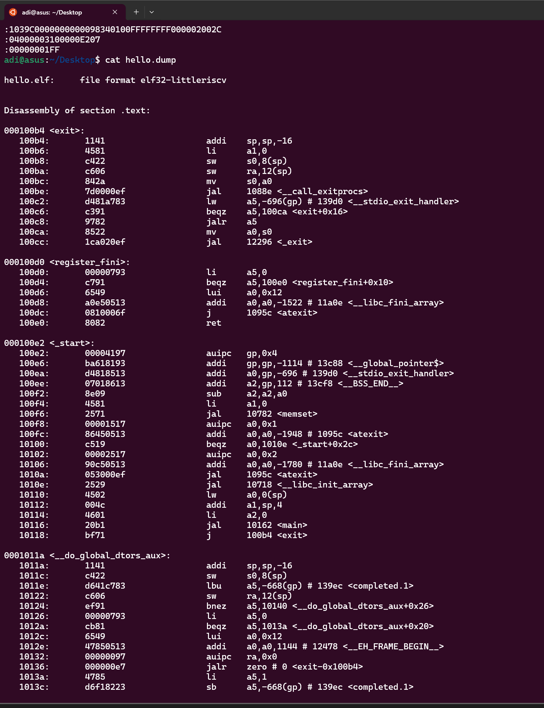

# Week 1 Task: Install & Sanity-Check the Toolchain

## 🎯 Objective
Set up the RISC-V toolchain, add it to the system PATH, and verify the functionality of the `gcc`, `objdump`, and `gdb` binaries.

---

## 🛠️ My Journey Through Week 1

### **Task 1: Install & Sanity-Check the Toolchain**

### Step 1: Downloading the Toolchain
I started by downloading the RISC-V toolchain archive using `wget`. This was a straightforward step to ensure I had the necessary tools for the tasks ahead:
```bash
wget https://vsd-labs.sgp1.cdn.digitaloceanspaces.com/vsd-labs/riscv-toolchain-rv32imac-x86_64-ubuntu.tar.gz
```

### Step 2: Extracting the Archive
Once the download was complete, I extracted the `.tar.gz` file to make the toolchain accessible:
```bash
tar -xzf riscv-toolchain-rv32imac-x86_64-ubuntu.tar.gz
```

### Step 3: Adding the Toolchain to PATH
To use the toolchain binaries from anywhere, I updated the PATH environment variable and made the change persistent:
```bash
export PATH=$HOME/Desktop/opt/riscv/bin:$PATH
echo 'export PATH=$HOME/Desktop/opt/riscv/bin:$PATH' >> ~/.bashrc
source ~/.bashrc
```

### Step 4: Verifying the Installation
I verified the installation by checking the versions of `gcc`, `objdump`, and `gdb`:
```bash
riscv32-unknown-elf-gcc --version
riscv32-unknown-elf-objdump --version
riscv32-unknown-elf-gdb --version
```

---

## 🖼️ Screenshot

  
*Screenshot of the terminal showing the commands and outputs.*

---

## 🛠️ Challenges and Fixes

### Issue: `riscv32-unknown-elf-gdb` Error
While verifying `gdb`, I encountered the following error:
```plaintext
riscv32-unknown-elf-gdb: error while loading shared libraries: libpython3.10.so.1.0: cannot open shared object file: No such file or directory
```
**Solution:** I checked for the required library and created a symbolic link to resolve the issue:
```bash
ldconfig -p | grep libpython3.10
sudo ln -s /usr/lib/x86_64-linux-gnu/libpython3.12.so.1.0 /usr/lib/x86_64-linux-gnu/libpython3.10.so.1.0
```
After this, `gdb` worked, albeit with some warnings about symbol sizes.

---

## **Task 2: Compile "Hello, RISC-V"**

### 🎯 Objective
Write and compile a minimal C program for the RISC-V architecture (RV32IMC) and verify the generated ELF file.

---

### My Steps

1. **Writing the Program**
I wrote a simple "Hello, RISC-V" program in C:
```c
#include <stdio.h>
int main() {
    printf("Hello, RISC-V!\n");
    return 0;
}
```

2. **Compiling the Program**
Initially, I tried compiling with specific architecture flags:
```bash
riscv32-unknown-elf-gcc -march=rv32imc -mabi=ilp32 -o hello.elf hello.c
```
This resulted in a multilib error. To resolve this, I recompiled without the flags:
```bash
riscv32-unknown-elf-gcc -o hello.elf hello.c
```

3. **Verifying the ELF File**
I confirmed the ELF file was correctly generated:
```bash
file hello.elf
```

4. **Running the Program**
Using QEMU, I ran the compiled ELF file:
```bash
qemu-riscv32 ./hello.elf
```
Output:
```plaintext
Hello, RISC-V world!
```

---

## 🖼️ Screenshots

  
*Screenshot of the terminal showing the compilation and ELF verification output.*

  
*Screenshot of the terminal showing the execution of the compiled ELF file using QEMU.*

---

## **Task 3: From C to Assembly**

### 🎯 Objective
Generate RISC-V assembly (`.s`) from your C source and understand the function prologue and epilogue.

---

### My Steps

1. **Generating the Assembly File**
I used the following command to generate the `.s` file:
```bash
riscv32-unknown-elf-gcc -S -O0 hello.c
```

2. **Inspecting the Assembly**
I opened the generated `hello.s` file and observed the following:
```asm
main:
    addi    sp,sp,-16         # Function prologue (make stack frame)
    sw      ra,12(sp)         # Save return address
    sw      s0,8(sp)          # Save frame pointer
    addi    s0,sp,16          # Set new frame pointer
    lui     a5,%hi(.LC0)
    addi    a0,a5,%lo(.LC0)
    call    puts
    li      a5,0
    mv      a0,a5
    lw      ra,12(sp)
    lw      s0,8(sp)
    addi    sp,sp,16          # Pop stack frame
    jr      ra                # Return to caller
```

3. **Understanding Prologue and Epilogue**
The prologue sets up the stack frame, while the epilogue restores it. This ensures the function can safely return and preserve state.

---

## 🖼️ Screenshot

  
*Screenshot of the terminal showing the generated assembly file `hello.s`.*

---

### 🔍 Explanation of the Output

The generated assembly file `hello.s` provides a low-level view of how the C program is translated into RISC-V instructions. Here's a breakdown of key sections:

1. **Prologue**
   ```asm
   addi    sp,sp,-16         # Reserve 16 bytes on the stack
   sw      ra,12(sp)         # Save return address
   sw      s0,8(sp)          # Save frame pointer
   addi    s0,sp,16          # Set s0 as the current frame pointer
   ```
   - The stack pointer (`sp`) is adjusted to allocate space for local variables and saved registers.
   - The return address (`ra`) and previous frame pointer (`s0`) are saved to the stack.
   - A new frame pointer (`s0`) is set for the current function.

2. **Main Function Logic**
   ```asm
   lui     a5,%hi(.LC0)      # Load upper immediate of the string address
   addi    a0,a5,%lo(.LC0)   # Load lower immediate to form the full address
   call    puts              # Call the `puts` function to print the string
   li      a5,0              # Load immediate 0 into register a5
   mv      a0,a5             # Move 0 into a0 (return value)
   ```
   - The string "Hello, RISC-V world!" is loaded into registers using `lui` and `addi`.
   - The `puts` function is called to print the string.
   - The return value of the function is set to 0 (indicating success).

3. **Epilogue**
   ```asm
   lw      ra,12(sp)         # Restore return address
   lw      s0,8(sp)          # Restore previous frame pointer
   addi    sp,sp,16          # Deallocate stack space
   jr      ra                # Return to the caller
   ```
   - The saved return address and frame pointer are restored from the stack.
   - The stack pointer is reset to its original position.
   - The function returns to the caller using the `jr` instruction.

4. **String Storage**
   ```asm
   .section        .rodata
   .align  2
.LC0:
   .string "Hello, RISC-V world!"
   ```
   - The string "Hello, RISC-V world!" is stored in the `.rodata` section, which is read-only data.
   - The `.align 2` directive ensures the string is aligned to a 4-byte boundary for efficient access.

5. **Metadata**
   ```asm
   .ident  "GCC: (g04696df096) 14.2.0"
   .section        .note.GNU-stack,"",@progbits
   ```
   - The `.ident` directive provides information about the GCC version used to compile the program.
   - The `.note.GNU-stack` section indicates that the program does not require an executable stack, improving security.

---

## **Task 4: Hex Dump & Disassembly**

### 🎯 Objective
Generate a hex dump and disassemble the compiled ELF file to understand its structure and contents.

---

### My Steps

1. **Disassembling the ELF File**
I used the following command to disassemble the ELF file and inspect its contents:
```bash
riscv32-unknown-elf-objdump -d hello.elf > hello.dump
```
This generated a file `hello.dump` containing the disassembled instructions.

2. **Generating a Hex Dump**
To view the raw machine code in hexadecimal format, I ran:
```bash
riscv32-unknown-elf-objcopy -O ihex hello.elf hello.hex
```
This created a file `hello.hex` with the hex representation of the ELF file.

3. **Inspecting the Output**
The disassembled file `hello.dump` provides a detailed breakdown of the instructions, including:
   - **Address**: The memory address of each instruction.
   - **Opcode**: The binary representation of the instruction.
   - **Mnemonic**: The human-readable assembly instruction.
   - **Operands**: The registers or memory locations used by the instruction.

---

## 🖼️ Hex and Dump Files

1. **Hex File**
     
   *Screenshot of the hex representation of the ELF file.*

2. **Dump File**
     
   *Screenshot of the disassembled instructions from the ELF file.*

---

## Summary of Week 1 Progress

During Week 1, we successfully set up the RISC-V toolchain, compiled and ran a "Hello, RISC-V" program, and explored the generated assembly and ELF file. Key highlights include:

1. **Toolchain Setup**: Installed and configured the RISC-V toolchain, resolving issues with `gdb` by creating a symbolic link for missing libraries.
2. **Hello World Program**: Wrote, compiled, and executed a simple C program using QEMU, verifying the output.
3. **Assembly Exploration**: Generated and analyzed the assembly file, understanding the function prologue and epilogue.
4. **Hex Dump & Disassembly**: Created a hex dump and disassembled the ELF file to inspect its structure and instructions.

This week provided a strong foundation in RISC-V toolchain usage and low-level program analysis.